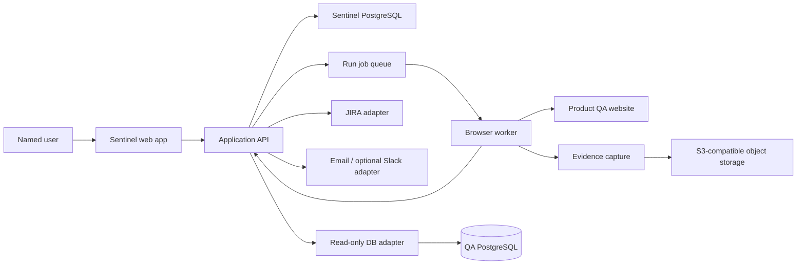
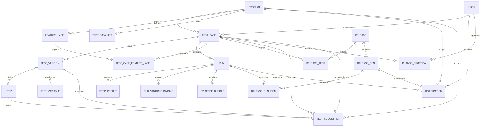

# Sentinel Architecture

**Status:** Provisional MVP baseline  
**Date:** 2026-08-05  
**Related requirements:** [`srd.md`](srd.md)

## 1. Architectural goals

- Make recording, replay, evidence, and human approval reliable before adding advanced intelligence.
- Keep product data, evidence, integrations, and job execution isolated behind clear boundaries.
- Treat uncertainty as a safety stop rather than an automatic guess.
- Enforce read-only database access technically, not only through application convention.
- Support multiple products and 10 concurrent users without prematurely building a distributed platform.

## 2. Provisional system shape

## 3. Components and responsibilities

### Web application

Provides authentication, a product-authorized health dashboard, product and Test Case management, Recording Workspace, Run Detail, Releases, notification inbox, a Phase 7 review queue, approvals, and manual actions. Its route-based App Shell uses the tokenized Sentinel frontend system documented in [`frontend.md`](frontend.md): a persistent sidebar, accessible semantic controls, and a desktop-first focused Recording Workspace. It never directly owns browser automation or external integration credentials.

### Application API

Validates user permissions, persists domain state, starts jobs, derives dashboard health metrics using a rolling UTC window, exposes Run/evidence/notification metadata, generates deterministic Phase 7 suggestion drafts, records audit events, and coordinates approval and integration workflows. API operations are the authorization boundary for all writes.

### Sentinel PostgreSQL

Stores users, product membership, Test Cases, versioned steps, variables, Releases, Runs, step results, Notifications, Phase 7 suggestion drafts, proposals, approvals, integration references, and audit records. Large evidence files are stored outside the relational database.

### Run queue and browser workers

Phase 2 retains one explicitly user-started guided Run directly in the existing noVNC browser. Phase 3 adds Redis/BullMQ and one worker service: the API atomically persists an Auto Run and attempt before enqueueing its ID, while the worker owns a headless Playwright context for that attempt. Phase 6 uses a separate BullMQ notification queue in that same worker service: the API persists each Notification before queueing its delivery, and the worker retries only one transient SMTP delivery failure. Worker concurrency is fixed at two for browser jobs in local Docker. Jobs, attempts, and database state make enqueue/retry idempotent; the worker never shares the guided Selenium/noVNC browser.

### Browser recording and replay

Playwright is the autonomous replay boundary for Chromium-based web testing. Each Phase 3 Auto Run uses a fresh headless Chromium context. It executes only the allowlisted Demo CRM, resolves selectors through ordered exact unique matches, and stops on missing or ambiguous matches. The first navigation uses the immutable Run target inherited from the allowlisted recording; later navigation records verify URL state after the preceding action. Password values come from worker-only configuration and free-text expected outcomes remain context rather than inferred assertions.

Phase 4 adds a server/worker-only variable boundary. AES-256-GCM encrypts reusable static values, local Test Data Set fields, and immutable per-Run bindings using a required deployment key. Recorded and saved steps contain placeholders, not variable values. A pre-run transaction validates product membership and local pool eligibility, creates encrypted bindings, reserves any selected pool data set, and then creates the Guided or Auto Run. Every set has an explicit reuse policy: reusable sets return to safe after any terminal Run outcome, while single-use sets become consumed only after a passed Run. The reservation remains exclusive while a Run is active, preventing concurrent use of the same values. Guided replay and the worker decrypt only the binding required to perform a text action. Evidence, audit text, API detail responses, queues, and browser logs receive only variable names, source metadata, and masked placeholders. Existing consumed sets are migrated to safe reusable sets. External pool adapters and read-only QA-database verification remain Phase 10 work.

Phase 5 adds feature-label and Release aggregates to the same modular monolith. A product-local feature-label record is joined to a Test Case, while a Test Case edit transaction clones the current version's ordered steps and variable configuration into the next immutable version. Existing versions and Runs are never altered. A Release owns a set of Test Case tags and a Release Run snapshots their exact current version IDs before submitting eligible items to the existing Auto Run queue. Each Release Run item keeps its own status, exclusion reason, and linked Auto Run. A shared completion helper projects linked Run terminal outcomes into the Release Run and derives readiness; it does not alter an individual Run's existing evidence, attempt, retry, or authorization boundary.

Phase 7 adds a deterministic rule module and a `TestSuggestion` aggregate without a new service or third-party model. The API takes a snapshot of the source Test Case's current immutable version, then considers only captured non-secret, non-variable text-entry validation metadata. It persists at most one suggestion for each source version, source step, and rule, so repeat generation is idempotent and historical dismissals are retained. Draft edits are limited to title, rationale, and a safe proposed value. Approval is a single PostgreSQL transaction: it creates an independent saved recording fixture and a new owner-approved Test Case with a new immutable Version 1, copies labels and safe variable configuration, applies only the proposed step value, links the suggestion, and writes audit events. It never schedules or starts a Run. Product membership is rechecked for every generation, queue query, draft action, and derived Test Case link.

For Phases 1–2, Sentinel hosts one local Chromium session in Docker and exposes its noVNC viewer inside a focused workspace. The embedded viewer hides noVNC's own clipboard, settings, fullscreen, and connection controls so it acts only as the remote display and input surface. Chromium runs in kiosk app mode, and managed browser policies block every URL except the allowlisted demo target and the exact internal recorder-event endpoint. Kiosk app mode removes the browser chrome and the host does not expose the WebDriver port. Developer Tools policy cannot be disabled in this Selenium design because ChromeDriver requires the same browser debugging protocol; URL policy remains the enforced navigation boundary. Before a new launch, Sentinel closes the browser it knows about and reclaims any Selenium session occupying the single slot, including a session that outlived a Sentinel restart. Each startup operation is time-bounded; a failed launch returns a retryable error rather than holding the workspace in a disabled state. The local Selenium node allows a guided session to remain idle for 30 minutes because noVNC input does not itself reset Selenium's idle timer. This replacement behavior is global to Phase 2: a browser-backed recording and a browser-backed Run cannot coexist. The Sentinel server attaches to that session through WebDriver, injects the Phase 1 recorder when teaching, and injects Phase 2 in-page fetch and warning/error-console instrumentation when guiding a Run. Password values are redacted before they leave the browser page.

### Evidence capture

Phase 2's API-led guided Run captures screenshots at start, end, and failure; network metadata and redacted allowlisted text/JSON snippets; warning/error console messages; and redacted cookie, local-storage, and session-storage metadata at step boundaries. Phase 3 reuses that persistence boundary for Playwright evidence, adding checkpoint screenshots. It never captures or retains browser video. The local Demo CRM deliberately issues same-origin activity requests and records minimal session state after its successful journey, so the evidence fixture demonstrates these capture paths; a quiet Console panel remains correct for a target that emits no warning or error. Screenshot binaries live in a private Docker-local MinIO bucket; PostgreSQL stores searchable metadata, checksums, object keys, timeline links, attempt links, and capture errors. In local development, MinIO's S3 endpoint is bound only to the host loopback interface so a browser can follow a Sentinel-authorized 15-minute signed `localhost` URL without making the bucket reachable from the wider network. The bucket remains private and Sentinel verifies product membership before issuing the URL. The Run outcome (`passed`, `failed`, or `interrupted`) is independent from evidence status (`complete` or `partial`), so missing evidence does not misrepresent the test result.

### Read-only database adapter

Provides explicitly configured, parameterized diagnostic queries against QA PostgreSQL. It uses a database role with `CONNECT` and `SELECT` privileges only, separate credentials from the application database, query timeouts, row limits, and audit logging. Sentinel has no generic SQL editor in v1.

### Integration adapters

Jira Cloud, email, and optional Slack calls are isolated behind adapters. Phase 8 adds one server-configured Jira Cloud connection and a Product-scoped project-key mapping that only the Product creator can change. A failed-Run filing is first persisted as a safe reviewer-editable draft, then a BullMQ job creates a fixed Bug or comments on the Test Case's linked open issue. A unique filing record per Run, an open-issue check, and adapter-level retry make external side effects idempotent. The adapter transfers only a safe summary, immutable reproduction steps, and a protected Sentinel Run Detail link; it never transfers evidence binaries, signed object URLs, raw operational evidence, variables, or credentials. Jira delivery state cannot alter factual Run/Release/evidence state. Phase 6 provides a local SMTP email adapter pointed at the Docker-local Mailpit service. Slack stays deferred until the email path and audit behavior are proven.

## 4. Core data relationships

Important invariants:

- A Test Case has exactly one current owner and one product.
- A saved Test Case references an immutable version; edits create a new version or proposal rather than mutating historical Runs.
- A Run points to the exact Test Case version used.
- A Test Case version and its ordered step kinds are immutable after save; an edit creates the next version in one transaction.
- A Release Run snapshots versions at batch start, so later Release tag edits cannot change an already-started batch.
- Release readiness is derived from every persisted item; a checkpoint, missing static variable default, or other ineligible item is visible as excluded rather than skipped.
- Evidence belongs to one Run and is access-controlled through the Run’s Test Case and product.
- A Notification belongs to one recipient and references the Product, Run, or Release Run that caused it; opening the notification or its link rechecks the recipient’s current authorization.
- A Test Suggestion belongs to one Product, source Test Case, immutable source version, source step, and deterministic rule. It never mutates that source or runs before an authorized product member approves it.
- Approving a Test Suggestion atomically creates a separately owned Test Case and immutable Version 1; the proposal changes one safe text value only and keeps its source relationship for auditability.
- An approval is tied to the owner identity at the time of the decision and is auditable.

## 5. Security boundaries

- Use server-side sessions or short-lived tokens; never expose provider secrets to the browser.
- Isolate each replay in a fresh browser context and redact configured secrets before persistence.
- Treat network payloads, cookies, storage, videos, and database results as sensitive data.
- Encrypt transport and stored evidence; use object-storage lifecycle and access policies.
- Validate target URLs against an approved QA environment policy to avoid unintended production access.
- Apply product-level authorization to Test Cases, Runs, evidence, releases, and approvals.
- Use a separate read-only QA database role and verify permissions in deployment checks.
- Record who created, edited, ran, approved, rejected, or externally filed an item.

## 6. Failure and consistency model

- Phase 3 Auto Run lifecycle adds `paused` and `cancelling` around the existing queued/running/completed state. A marked checkpoint pauses after the action and expires after 10 minutes; cancellation captures final available evidence then completes as interrupted. A technical failure can create exactly one linked retry attempt; unsafe selectors and user-visible action failures never retry.
- The API persists step and evidence events incrementally so a browser or capture failure leaves useful partial evidence and an actionable error.
- Retries create a new Run attempt record or a clearly linked retry, never silently overwrite the original.
- JIRA creation uses an idempotency key derived from the tracked failure; duplicate detection is checked before create.
- Notification delivery is asynchronous and retryable; notification failure must not change the Run result.
- Dashboard statistics are read-model calculations over only currently authorized Products and fixed UTC 30-day boundaries; they never mutate Run or Test Case history.
- Database insight is best-effort diagnostic context. A query timeout or denied query is visible as incomplete context, not a test pass.

## 7. Why this is appropriately simple for the MVP

For 10 concurrent users, one web application, one relational database, one job queue, and isolated browser workers are sufficient. A modular monolith keeps transactions and ownership logic easy to understand. Evidence storage and workers are separate because browser execution and binary retention have different resource profiles.

The design avoids Kubernetes, microservices per feature, a general-purpose AI agent, and generic SQL execution. Those alternatives add operational and security complexity before the core teach-and-replay workflow is proven.

## 8. Major alternatives considered

| Decision | Provisional choice | Simpler or competing alternative | Reason |
|---|---|---|---|
| Browser control | Playwright | Raw browser protocol or Selenium | Strong event, network, video, context, and multi-browser support with a TypeScript API. |
| Application shape | Modular monolith | Feature microservices | Lower operational cost and clearer transactions at the initial scale. |
| Evidence | Object storage plus metadata | Store all evidence in PostgreSQL | Better for large video and logs; database remains queryable. |
| Work execution | Durable queue and workers | Run browsers inside web requests | Prevents request timeouts and isolates concurrency. |
| Change handling | Human approval workflow | Silent self-healing | Safety and auditability are more important than eliminating review. |
| Database insight | Allowlisted read-only queries | Generic SQL endpoint | Limits data exposure and prevents write capability. |

## 9. Deferred architecture decisions

- Identity provider and shared-login identity mapping.
- Final frontend deployment platform; the UI foundation is custom React components and CSS tokens as documented in `frontend.md`.
- Evidence storage provider, retention, redaction, and budget.
- Queue implementation and concurrency limits.
- JIRA authentication, project, fields, and duplicate key.
- Email/Slack provider and delivery policy.
- Database schema discovery and approved diagnostic query catalog.
- Ownership reassignment workflow.
