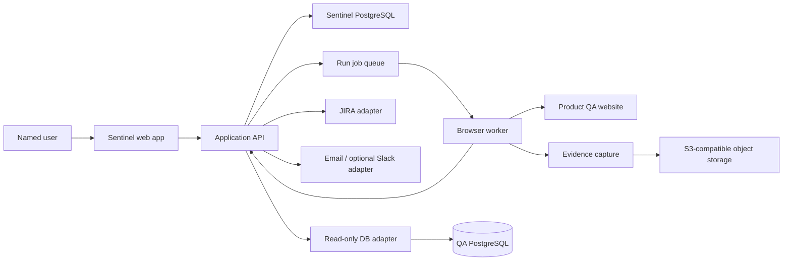
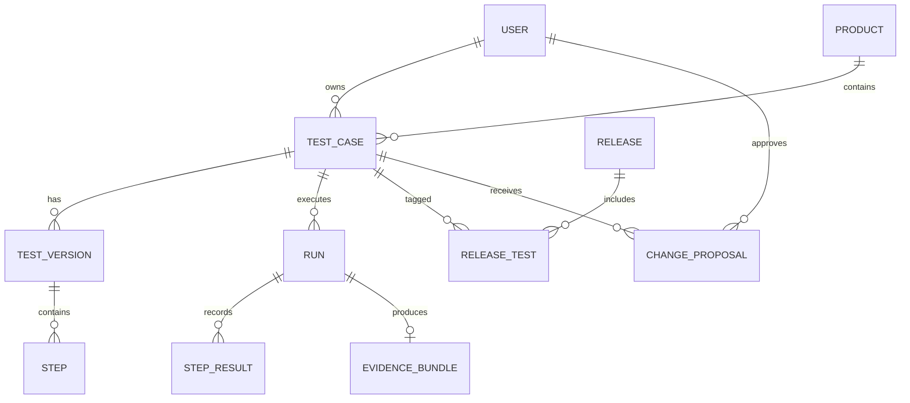

# Sentinel Architecture

**Status:** Provisional MVP baseline  
**Date:** 2026-08-05  
**Related requirements:** [`srd.md`](srd.md)

## 1. Architectural goals

- Make recording, replay, evidence, and human approval reliable before adding advanced intelligence.
- Keep product data, evidence, integrations, and job execution isolated behind clear boundaries.
- Treat uncertainty as a safety stop rather than an automatic guess.
- Enforce read-only database access technically, not only through application convention.
- Support multiple products and 10 concurrent users without prematurely building a distributed platform.

## 2. Provisional system shape

## 3. Components and responsibilities

### Web application

Provides authentication, dashboard, product and Test Case management, Recording Workspace, Run Detail, release views, approvals, and manual actions. Its route-based App Shell uses the tokenized Sentinel frontend system documented in [`frontend.md`](frontend.md): a persistent sidebar, accessible semantic controls, and a desktop-first focused Recording Workspace. It never directly owns browser automation or external integration credentials.

### Application API

Validates user permissions, persists domain state, starts jobs, exposes Run and evidence metadata, records audit events, and coordinates approval and integration workflows. API operations are the authorization boundary for all writes.

### Sentinel PostgreSQL

Stores users, product membership, Test Cases, versioned steps, variables, releases, Runs, step results, proposals, approvals, integration references, and audit records. Large evidence files are stored outside the relational database.

### Run queue and browser workers

The API places replay work on a durable queue. Workers execute isolated browser contexts, apply controlled concurrency, stop on low-confidence actions or checkpoints, and report state transitions. Jobs must be idempotent so retries do not duplicate Runs or JIRA effects.

### Browser recording and replay

Playwright is the provisional browser boundary for Chromium-based web testing. Recording observes supported actions and page lifecycle events. Replay begins with recorded selectors and semantic metadata, applies bounded fallback strategies, and stops when confidence is insufficient.

For Phase 1, Sentinel hosts one local Chromium session in Docker and exposes its noVNC viewer inside the Recording Workspace. Chromium runs in kiosk app mode, and managed browser policies block every URL except the allowlisted demo target and the exact internal recorder-event endpoint. Kiosk app mode removes the browser chrome and the host does not expose the WebDriver port. Developer Tools policy cannot be disabled in this Selenium design because ChromeDriver requires the same browser debugging protocol; URL policy remains the enforced navigation boundary. The Sentinel server attaches to that session through the browser automation protocol and injects a recorder before loading the allowlisted demo target. The injected recorder posts normalized navigation, click, and final field-entry events to an authenticated internal endpoint. Password values are redacted before they leave the browser page.

### Evidence capture

Workers capture video, screenshots, network events, console events, storage snapshots, and timestamps. A normalized event timeline links evidence to Test Case steps. Object storage holds binaries and large logs; the database holds metadata, checksums, and access-controlled references.

### Read-only database adapter

Provides explicitly configured, parameterized diagnostic queries against QA PostgreSQL. It uses a database role with `CONNECT` and `SELECT` privileges only, separate credentials from the application database, query timeouts, row limits, and audit logging. Sentinel has no generic SQL editor in v1.

### Integration adapters

JIRA, email, and optional Slack calls are isolated behind adapters. Each adapter translates Sentinel events into provider requests, stores external IDs, handles retry and rate limits, and exposes failure state without making the core domain depend on provider-specific fields.

## 4. Core data relationships

Important invariants:

- A Test Case has exactly one current owner and one product.
- A saved Test Case references an immutable version; edits create a new version or proposal rather than mutating historical Runs.
- A Run points to the exact Test Case version used.
- Evidence belongs to one Run and is access-controlled through the Run’s Test Case and product.
- An approval is tied to the owner identity at the time of the decision and is auditable.

## 5. Security boundaries

- Use server-side sessions or short-lived tokens; never expose provider secrets to the browser.
- Isolate each replay in a fresh browser context and redact configured secrets before persistence.
- Treat network payloads, cookies, storage, videos, and database results as sensitive data.
- Encrypt transport and stored evidence; use object-storage lifecycle and access policies.
- Validate target URLs against an approved QA environment policy to avoid unintended production access.
- Apply product-level authorization to Test Cases, Runs, evidence, releases, and approvals.
- Use a separate read-only QA database role and verify permissions in deployment checks.
- Record who created, edited, ran, approved, rejected, or externally filed an item.

## 6. Failure and consistency model

- Run states are explicit: queued, running, paused-for-checkpoint, passed, failed, cancelled, and capture-incomplete.
- A worker reports step and evidence events incrementally so a crash leaves useful partial evidence.
- Retries create a new Run attempt record or a clearly linked retry, never silently overwrite the original.
- JIRA creation uses an idempotency key derived from the tracked failure; duplicate detection is checked before create.
- Notification delivery is asynchronous and retryable; notification failure must not change the Run result.
- Database insight is best-effort diagnostic context. A query timeout or denied query is visible as incomplete context, not a test pass.

## 7. Why this is appropriately simple for the MVP

For 10 concurrent users, one web application, one relational database, one job queue, and isolated browser workers are sufficient. A modular monolith keeps transactions and ownership logic easy to understand. Evidence storage and workers are separate because browser execution and binary retention have different resource profiles.

The design avoids Kubernetes, microservices per feature, a general-purpose AI agent, and generic SQL execution. Those alternatives add operational and security complexity before the core teach-and-replay workflow is proven.

## 8. Major alternatives considered

| Decision | Provisional choice | Simpler or competing alternative | Reason |
|---|---|---|---|
| Browser control | Playwright | Raw browser protocol or Selenium | Strong event, network, video, context, and multi-browser support with a TypeScript API. |
| Application shape | Modular monolith | Feature microservices | Lower operational cost and clearer transactions at the initial scale. |
| Evidence | Object storage plus metadata | Store all evidence in PostgreSQL | Better for large video and logs; database remains queryable. |
| Work execution | Durable queue and workers | Run browsers inside web requests | Prevents request timeouts and isolates concurrency. |
| Change handling | Human approval workflow | Silent self-healing | Safety and auditability are more important than eliminating review. |
| Database insight | Allowlisted read-only queries | Generic SQL endpoint | Limits data exposure and prevents write capability. |

## 9. Deferred architecture decisions

- Identity provider and shared-login identity mapping.
- Final frontend deployment platform; the UI foundation is custom React components and CSS tokens as documented in `frontend.md`.
- Evidence storage provider, retention, redaction, and budget.
- Queue implementation and concurrency limits.
- JIRA authentication, project, fields, and duplicate key.
- Email/Slack provider and delivery policy.
- Database schema discovery and approved diagnostic query catalog.
- Ownership reassignment workflow.
