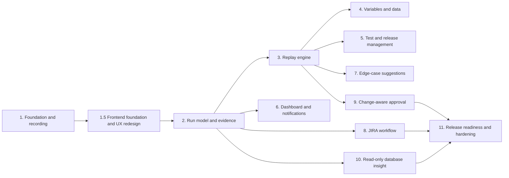

# Sentinel Build Phases

**Status:** Planning baseline  
**Date:** 2026-08-05  
**Source of truth:** [`srd.md`](srd.md) and [`architecture.md`](architecture.md)

## Phase order and dependencies



## Phase 1 — Foundation and guided recording

**Status:** Acceptance criteria verified; owner learning review remains pending.
**Goal:** Prove the smallest useful teach-and-save workflow with named ownership.

### In scope

- Local/development named-user authentication boundary.
- Docker Compose development stack with PostgreSQL, a remote Chromium/noVNC session, and an isolated demo target.
- Product creation and selection.
- Test Case creation with name, website link, product, owner, and timestamps.
- Recording Workspace with a live browser surface and Step Log.
- Basic navigation, click, and text-entry event capture in order.
- Editable step description and expected outcome.
- Inline variable marker stored as metadata, without variable-pool automation yet.
- Save and discard behavior.
- Versioned persistence foundation and audit event for creation.
- One active browser-in-browser recording session against the local sign-in and create-customer demo flow.

### Acceptance checklist

- [x] A named user can sign in using the development identity path.
- [x] A user can create and select a Product.
- [x] A Product creator can rename the Product with blank/duplicate validation and view only that Product's filtered Test Cases.
- [x] **Add New Test** accepts a name and approved website URL.
- [x] The workspace shows the live target and an initially empty Step Log.
- [x] The live browser runs in kiosk app mode, fills the browser stage, and blocks navigation outside the approved demo target.
- [x] A navigation creates a navigation step with timestamp and target context.
- [x] A click creates a click step with target metadata.
- [x] Text entry creates a text step without persisting unredacted secrets by default.
- [x] Steps appear in action order and remain associated with the current Test Case draft.
- [x] A tester can edit description and expected outcome for each step.
- [x] A tester can mark a text value as a variable placeholder.
- [x] Save creates a Test Case linked to exactly one product and named owner.
- [x] Discard leaves no saved Test Case or orphaned draft.
- [x] Refreshing the saved Test Case shows the same ordered steps and annotations.
- [x] Unauthorized users cannot open another product’s Test Case.

### Verification

Run the exact project checks after the toolchain is created:

```text
npm run lint
npm run typecheck
npm test
npx playwright test tests/phase-1-recording.spec.ts
```

The phase is not complete until the commands and raw output are recorded, the acceptance checklist is checked, the diff is reviewed in priority order, and the owner answers the feature’s ten learning questions or records follow-up tasks.

### Deliverables

- Working Phase 1 recording slice.
- Tests for authentication boundary, authorization, step capture, annotation, save, discard, and persistence.
- Updated `learning-log.md` entry with exactly 10 questions.
- Updated `decisions-log.md`, `README.md`, and this checklist.

## Phase 1.5 — Frontend foundation and UX redesign

**Depends on:** Phase 1 functional acceptance
**Status:** Acceptance criteria verified; owner learning review remains pending.
**Outcome:** Sentinel has a coherent, accessible, route-based operations UI for all delivered Phase 1 flows, plus documented visual specifications for future product areas.

### In scope

- A fixed custom CSS token system, CSS-rendered Sentinel mark, local system typography, and reusable frontend primitives.
- Toggleable sidebar and route-based Phase 1 views for sign-in, metrics dashboard, Products, Test Cases, Test Case detail, creation, and Recording Workspace.
- A dark operations interface with purposeful reduced-motion-safe transitions and WCAG 2.2 AA interaction requirements.
- Desktop-first live recording with a narrow-screen guidance state; responsive dashboard and inventory views.
- Documented future UI direction for Runs, Releases, Review, and Settings without placeholder feature implementation.

### Acceptance checklist

- [x] `frontend.md` records all approved visual, interaction, accessibility, responsive, and future-information-architecture decisions.
- [x] Semantic CSS tokens are the only source of implemented UI colours.
- [x] Existing Phase 1 APIs, authorization, persistence, save, discard, and recorder behavior remain unchanged.
- [x] Sign-in, metrics dashboard, dedicated Product creation, Test Case inventory/detail, creation, and Recording Workspace use the route-based App Shell; New recording appears only in the top bar.
- [x] New recording opens as a labelled modal; the active Recording Workspace is chrome-free, gives the Step Log 30% and browser 70% of the desktop workspace, and requires an explicit save/discard decision before leaving.
- [x] Keyboard focus, labels, feedback, non-colour status cues, contrast, and reduced-motion behavior meet the documented WCAG 2.2 AA checks.
- [x] The Recording Workspace remains usable on desktop and clearly guides narrow-screen users to a desktop viewport.
- [x] Playwright verifies new route navigation, keyboard/focus behavior, Product validation feedback, saved-test persistence, recording layout, and narrow-screen guidance.
- [x] Existing lint, type-check, unit, Product creation, and remote-recording tests pass.

### Verification

```text
docker compose exec sentinel npm run lint
docker compose exec sentinel npm run typecheck
docker compose exec sentinel npm test
docker compose exec sentinel npx playwright test tests/product-creation.spec.ts
docker compose exec sentinel npx playwright test tests/phase-1-recording.spec.ts
docker compose exec sentinel npx playwright test tests/frontend-phase-1-5.spec.ts
```

### Deliverables

- `frontend.md` design source of truth and synchronized project documents.
- Token stylesheet, reusable App Shell and component primitives, and redesigned Phase 1 routes.
- Automated and manual desktop, tablet, keyboard, and reduced-motion verification evidence.

## Phase 2 — Run model and complete evidence

**Depends on:** Phases 1 and 1.5
**Outcome:** A saved Test Case can produce a Run record and a Run Detail view with evidence metadata.

- Define Run lifecycle and step-result contracts.
- Capture video, screenshots, network, console, and storage snapshots for teaching and Runs.
- Store large evidence in object storage with access controls and checksums.
- Link every event to a step timeline and show partial-capture failures.
- Test passed, failed, and interrupted Runs plus sensitive-data redaction.

## Phase 3 — Autonomous replay engine

**Depends on:** Phases 1–2  
**Outcome:** A Test Case can replay safely and stop on uncertainty.

- Implement isolated browser contexts and recorded action execution.
- Add bounded selector resilience and confidence-based stopping.
- Support checkpoints, pause/resume, cancellation, retries, and controlled concurrency.
- Compare replay duration with a defined manual benchmark.
- Verify every replay produces the Phase 2 evidence bundle.

## Phase 4 — Variables and test-data lifecycle

**Depends on:** Phase 3  
**Outcome:** Static, pooled, and per-Run values can be selected and tracked safely.

- Define variable contracts, masking, substitution, and lifecycle states.
- Integrate an existing reusable pool through an adapter.
- Add manual per-Run input and conservative variable suggestions.
- Add read-only state checks where configured and test consumed-value replacement.

## Phase 5 — Test Case and release management

**Depends on:** Phase 3  
**Outcome:** Testers can organize, update, tag, and batch-run Test Cases.

- Add feature-area organization and Test Case version history.
- Support partial updates without rewriting unrelated steps.
- Create releases, tag Test Cases across products, and run release batches.
- Produce consolidated release-readiness reports and preserve ad hoc execution.

## Phase 6 — Dashboard and notifications

**Depends on:** Phase 2 and Phase 5  
**Outcome:** Users can see health, trends, and pending human actions.

- Add product dashboard, last-run status, failure frequency, and coverage trends.
- Add email notifications for failures, checkpoints, and pending approvals.
- Add optional Slack adapter only after email and notification audit behavior work.

## Phase 7 — Edge-case and negative-test suggestions

**Depends on:** Phase 3 and Phase 5  
**Outcome:** High-confidence suggestions become reviewable draft Test Cases.

- Generate conservative missing-input, invalid-input, and boundary suggestions.
- Allow approve, edit, and dismiss actions with audit history.
- Ensure suggestions never run or alter baselines before approval.

## Phase 8 — JIRA bug workflow

**Depends on:** Phase 2 and Phase 6  
**Outcome:** Likely bugs create or update JIRA issues with evidence.

- Configure server-side JIRA adapter and required fields.
- Generate clear reproduction steps and evidence links/attachments.
- Implement duplicate-open-issue detection and idempotent retries.
- Allow review/edit before or immediately after filing.

## Phase 9 — Change-aware approval

**Depends on:** Phases 3, 6, and 8  
**Outcome:** Intentional changes are proposed to the original owner without silent baseline updates.

- Compare expected and observed behavior after a known QA deployment.
- Draft side-by-side step or expectation proposals.
- Route approval to the original owner, maintain old baseline until approval, and route rejection to JIRA.
- Store complete proposal, decision, and Test Case history.

## Phase 10 — Read-only database insight

**Depends on:** Phase 2 and confirmed database access  
**Outcome:** Failures can include safe, relevant database context.

- Define an allowlisted diagnostic query catalog and parameter contracts.
- Provision a database role that cannot write and verify it automatically.
- Add timeouts, row limits, redaction, audit logging, and incomplete-context states.
- Attach relevant results to Run Detail and JIRA evidence.

## Phase 11 — Release readiness and hardening

**Depends on:** Phases 4–10  
**Outcome:** The platform is ready for a controlled internal pilot.

- Re-run all acceptance criteria and security checks.
- Test concurrency, retries, evidence retention, notification failure, JIRA rate limits, and database denial.
- Run an adversarial review against `problem-brief.md`, `srd.md`, and `architecture.md`.
- Resolve ownership reassignment, retention, target metrics, and provider configuration.
- Complete setup documentation, learning reviews, and a single-file commit/push audit.
