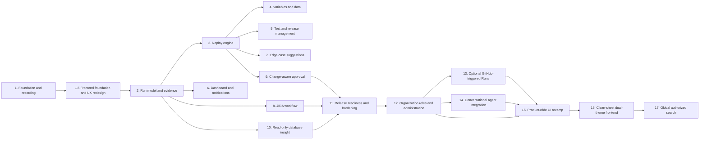

# Sentinel Build Phases

**Status:** Planning baseline  
**Date:** 2026-08-05  
**Source of truth:** [`srd.md`](srd.md) and [`architecture.md`](architecture.md)

## Phase order and dependencies



## Phase 1 — Foundation and guided recording

**Status:** Acceptance criteria verified; owner learning review remains pending.
**Goal:** Prove the smallest useful teach-and-save workflow with named ownership.

### In scope

- Local/development named-user authentication boundary.
- Docker Compose development stack with PostgreSQL, a remote Chromium/noVNC session, and an isolated demo target.
- Product creation and selection.
- Test Case creation with name, website link, product, owner, and timestamps.
- Recording Workspace with a live browser surface and Step Log.
- Basic navigation, click, and text-entry event capture in order.
- Editable step description and expected outcome.
- Inline variable marker stored as metadata, without variable-pool automation yet.
- Save and discard behavior.
- Versioned persistence foundation and audit event for creation.
- One active browser-in-browser recording session against the local sign-in and create-customer demo flow.

### Acceptance checklist

- [x] A named user can sign in using the development identity path.
- [x] A user can create and select a Product.
- [x] A Product creator can rename the Product with blank/duplicate validation and view only that Product's filtered Test Cases.
- [x] **Add New Test** accepts a name and approved website URL.
- [x] The workspace shows the live target and an initially empty Step Log.
- [x] The live browser runs in kiosk app mode, fills the browser stage, and blocks navigation outside the approved demo target.
- [x] A navigation creates a navigation step with timestamp and target context.
- [x] A click creates a click step with target metadata.
- [x] Text entry creates a text step without persisting unredacted secrets by default.
- [x] Steps appear in action order and remain associated with the current Test Case draft.
- [x] A tester can edit description and expected outcome for each step.
- [x] A tester can mark a text value as a variable placeholder.
- [x] Save creates a Test Case linked to exactly one product and named owner.
- [x] Discard leaves no saved Test Case or orphaned draft.
- [x] Refreshing the saved Test Case shows the same ordered steps and annotations.
- [x] Unauthorized users cannot open another product’s Test Case.

### Verification

Run the exact project checks after the toolchain is created:

```text
npm run lint
npm run typecheck
npm test
npx playwright test tests/phase-1-recording.spec.ts
```

The phase is not complete until the commands and raw output are recorded, the acceptance checklist is checked, the diff is reviewed in priority order, and the owner answers the feature’s ten learning questions or records follow-up tasks.

### Deliverables

- Working Phase 1 recording slice.
- Tests for authentication boundary, authorization, step capture, annotation, save, discard, and persistence.
- Updated `learning-log.md` entry with exactly 10 questions.
- Updated `decisions-log.md`, `README.md`, and this checklist.

## Phase 1.5 — Frontend foundation and UX redesign

**Depends on:** Phase 1 functional acceptance
**Status:** Acceptance criteria verified; owner learning review remains pending.
**Outcome:** Sentinel has a coherent, accessible, route-based operations UI for all delivered Phase 1 flows, plus documented visual specifications for future product areas.

### In scope

- A fixed custom CSS token system, CSS-rendered Sentinel mark, local system typography, and reusable frontend primitives.
- Toggleable sidebar and route-based Phase 1 views for sign-in, metrics dashboard, Products, Test Cases, Test Case detail, creation, and Recording Workspace.
- A dark operations interface with purposeful reduced-motion-safe transitions and WCAG 2.2 AA interaction requirements.
- Desktop-first live recording with a narrow-screen guidance state; responsive dashboard and inventory views.
- Documented future UI direction for Runs, Releases, Review, and Settings without placeholder feature implementation.

### Acceptance checklist

- [x] `frontend.md` records all approved visual, interaction, accessibility, responsive, and future-information-architecture decisions.
- [x] Semantic CSS tokens are the only source of implemented UI colours.
- [x] Existing Phase 1 APIs, authorization, persistence, save, discard, and recorder behavior remain unchanged.
- [x] Sign-in, metrics dashboard, dedicated Product creation, Test Case inventory/detail, creation, and Recording Workspace use the route-based App Shell; New recording appears only in the top bar.
- [x] New recording opens as a labelled modal; the active Recording Workspace is chrome-free, gives the Step Log 30% and browser 70% of the desktop workspace, and requires an explicit save/discard decision before leaving.
- [x] Keyboard focus, labels, feedback, non-colour status cues, contrast, and reduced-motion behavior meet the documented WCAG 2.2 AA checks.
- [x] The Recording Workspace remains usable on desktop and clearly guides narrow-screen users to a desktop viewport.
- [x] Playwright verifies new route navigation, keyboard/focus behavior, Product validation feedback, saved-test persistence, recording layout, and narrow-screen guidance.
- [x] Existing lint, type-check, unit, Product creation, and remote-recording tests pass.

### Verification

```text
docker compose exec sentinel npm run lint
docker compose exec sentinel npm run typecheck
docker compose exec sentinel npm test
docker compose exec sentinel npx playwright test tests/product-creation.spec.ts
docker compose exec sentinel npx playwright test tests/phase-1-recording.spec.ts
docker compose exec sentinel npx playwright test tests/frontend-phase-1-5.spec.ts
```

### Deliverables

- `frontend.md` design source of truth and synchronized project documents.
- Token stylesheet, reusable App Shell and component primitives, and redesigned Phase 1 routes.
- Automated and manual desktop, tablet, keyboard, and reduced-motion verification evidence.

## Phase 2 — Run model and complete evidence

**Depends on:** Phases 1 and 1.5
**Status:** Functional acceptance verified; owner learning review remains pending.
**Outcome:** A saved Test Case can produce a locally guided Run record and a Run Detail view with privacy-safe, timeline-linked evidence metadata.

### In scope

- A named, product-authorized tester starts an explicitly guided Run from the current immutable Test Case version and completes the saved steps in strict order inside the existing isolated Demo CRM browser.
- Persist a Run lifecycle (`QUEUED`, `RUNNING`, `COMPLETED`), a nullable outcome (`PASSED`, `FAILED`, `INTERRUPTED`), and separate evidence state (`COMPLETE`, `PARTIAL`). Partial evidence never changes the actual test outcome.
- Create one Run Step Result per saved step. Passing the active step advances; failing captures available failure evidence and safely completes the Run. Skip, pause, cancellation, arbitrary step order, and autonomous replay are deferred.
- Resume the active Run and browser session after a Sentinel page refresh.
- Capture screenshots at Run start, Run end, and failure; redacted network metadata/body snippets; warning/error console messages; and redacted cookie, local-storage, and session-storage metadata at completed-step boundaries.
- Store screenshots in private Docker-local MinIO object storage with checksums. Persist searchable evidence metadata and partial-capture errors in PostgreSQL. Access artifacts only through product-authorized, 15-minute signed URLs.
- Add Run inventory and Run Detail/live guided-workspace views. Only one browser-backed recording or Run is active locally at a time.

### Explicit exclusions

- Do not capture or retain full browser-video recordings for teaching sessions or Runs.
- Do not automatically replay saved actions, add workers/Redis/BullMQ, connect external QA targets, schedule Runs, or add checkpoint/skip behavior. These belong to later phases.

### Acceptance checklist

- [x] An authorized user can start a guided Run from a saved Test Case and its exact current version is retained.
- [x] The Run requires steps to be completed in sequence; pass advances and failure safely ends the Run.
- [x] A page refresh restores an active Run and its remote browser session.
- [x] Passed, failed, and interrupted outcomes persist with timestamps and ordered step results.
- [x] Screenshots, network, console, and storage evidence are linked to the Run timeline without retaining browser video.
- [x] Secret values, cookies, tokens, authorization headers, and sensitive payload fields are redacted before persistence.
- [x] Screenshots are private in MinIO, checksummed, and available only to authorized users through short-lived signed URLs.
- [x] Evidence capture problems are visible as `PARTIAL` without replacing the test outcome.
- [x] A user without Product membership cannot list, inspect, start, or obtain evidence for that Product's Runs.
- [x] Owner manually completes the guided-browser checklist after the automated unit, integration, and Playwright checks pass.

### Verification

```text
docker compose up --build -d
docker compose exec sentinel npm run lint
docker compose exec sentinel npm run typecheck
docker compose exec sentinel npm test
docker compose exec sentinel npx playwright test tests/phase-2-runs.spec.ts
docker compose down
```

## Phase 3 — Autonomous replay engine

**Depends on:** Phases 1–2
**Status:** Implementation and automated acceptance verified; owner learning review pending.
**Outcome:** A saved Test Case can run autonomously in an isolated headless browser, stop safely on uncertainty, and retain the Phase 2 evidence bundle.

### In scope

- Keep the existing guided Run unchanged and add a separate **Auto Run** action.
- Use Redis and BullMQ with one Docker-local worker process that executes at most two Auto Runs concurrently in isolated headless Playwright Chromium contexts.
- Bind every Auto Run to the current immutable Test Case version and create one persistent Run Attempt per execution attempt.
- Replay the allowlisted Demo CRM only. Supply its login credentials through worker-only Docker environment variables; never persist them in a Run, Step Result, evidence item, or browser log.
- Add `GUIDED` and `AUTO` Run modes; queued, running, paused, cancelling, and completed lifecycle states; attempt history; and explicit failure reasons.
- Replay first navigation steps with `goto`; treat later navigation steps as URL milestones so in-page state is preserved.
- Resolve click and text-entry targets only through ordered, exact, unique selector fallbacks: test ID, name/label, role plus exact accessible name, then tag plus exact text. Missing or ambiguous matches fail safely without guessing.
- Treat free-text expected outcomes as human-readable context in evidence and failure reporting, not executable assertions.
- Block an Auto Run when a non-password step has a variable marker, with clear Phase 4 guidance. Existing saved Test Cases remain compatible without re-recording and have no checkpoints unless a new recording marks them.
- Add a checkpoint toggle to draft-step editing. After an Auto Run executes a marked step, capture checkpoint evidence, pause for screenshot/outcome review, and wait up to 10 minutes for Continue or Cancel while retaining the browser context.
- Support explicit cancellation with final available evidence and `INTERRUPTED` outcome.
- Retry exactly once and only for allowlisted technical startup/navigation failures. Preserve the failed attempt and its evidence, then enqueue a linked second attempt. Never retry ambiguity, action failures, checkpoints, cancellation, or user-visible test failures.
- Capture screenshots at start, end, failure, and checkpoints plus the existing redacted network, warning/error-console, and storage evidence. Full browser video remains prohibited.
- Compare successful Auto Run active duration, excluding queue, checkpoint, and retry wait time, to the median duration of the latest three successful guided Runs of the same Test Case version. Show benchmark unavailable when fewer than three exist; do not fail the Run for that reason.

### Acceptance checklist

- [x] A product-authorized tester can queue an Auto Run separately from a guided Run.
- [x] Redis/BullMQ persists queued Auto Runs and the worker processes at most two isolated Playwright contexts concurrently.
- [x] An Auto Run executes the Demo CRM sign-in and customer journey without tester interaction and produces the Phase 2 evidence bundle without video.
- [x] Password credentials never appear in persisted steps, attempts, evidence, logs, or API responses.
- [x] Existing saved Test Cases replay without re-recording; a variable-marked non-password step blocks only Auto Run with clear Phase 4 guidance.
- [x] Unique exact selector fallbacks recover supported cosmetic selector changes; missing or multiple matches stop safely with an explicit reason.
- [x] A checkpoint pauses after its marked action, shows checkpoint evidence and expected outcome context, resumes within 10 minutes, or interrupts safely on timeout/cancel.
- [x] An explicit cancellation captures final available evidence and never retries.
- [x] Exactly one technical retry is linked to the original Run; non-technical failures never retry.
- [x] Auto Run duration is compared against the defined three-guided-Run median when available.
- [x] Product authorization protects Auto Run queueing, inspection, resume, cancel, attempts, and evidence access.
- [x] Guided Run behavior, single noVNC browser isolation, and Phase 1–2 acceptance remain unchanged.

### Verification

```text
docker compose up --build -d
docker compose exec sentinel npm run lint
docker compose exec sentinel npm run typecheck
docker compose exec sentinel npm test
docker compose exec sentinel npx playwright test tests/phase-3-auto-runs.spec.ts
docker compose exec sentinel npx playwright test tests/phase-2-runs.spec.ts
docker compose exec sentinel npx playwright test tests/phase-1-recording.spec.ts
docker compose down
```

Automated verification on 2026-08-11 covered the six-file, 19-test Vitest suite; the Phase 1 browser-lock, Product creation, recording, and frontend regressions; the Phase 2 guided-Run regression; and the Phase 3 Auto Run browser flow. The ten Phase 3 owner questions in `learning-log.md` remain an explicit follow-up, so the phase is not yet marked fully understood.

### Deliverables

- Redis/BullMQ queue and two-concurrency Playwright worker.
- Auto Run persistence, API, controls, attempt history, checkpoint review, cancellation, retry, and duration comparison.
- Selector-resolution and replay engine with privacy-safe evidence reuse.
- Phase 3 automated and manual acceptance evidence plus a learning-log entry with exactly 10 questions.

## Phase 4 — Variables and test-data lifecycle

**Depends on:** Phase 3  
**Status:** Implementation and automated acceptance verified; owner learning review pending.
**Outcome:** Variable-marked Test Cases can run safely with encrypted static, pooled, or manual values in either Guided or Auto mode.

### In scope

- Canonical shared variable names, encrypted static defaults, encrypted per-Run bindings, and placeholders in recorded/saved steps.
- A Docker-local, product-scoped Test Data Set pool with encrypted keyed fields, `REUSABLE` (default) and `SINGLE_USE` policies, and `SAFE`, `RESERVED`, `CONSUMED`, and `INVALID` lifecycle states.
- Product-member Test Data management, invalidation, replacement, audit events, and masked list/detail responses.
- A Test Case variable-configuration section and a pre-run binding form for both Guided and Auto Runs.
- Atomic local-pool field-completeness, authorization, and reservation checks. Reusable data releases after every terminal outcome; single-use data is consumed only after Passed and otherwise releases.
- Guided and Auto substitution from server/worker-only encrypted bindings. Auto retries reuse the original binding.
- A safe migration of existing variable-marked steps and rejection of secret-like variable values. Existing server-only password handling remains separate.

### Explicit exclusions

- External test-data adapters, QA PostgreSQL state validation, database writes, secrets management beyond existing server-only credentials, scheduling, releases, JIRA, and notifications.

### Acceptance checklist

- [x] Variable values are encrypted at rest and raw values do not appear in saved steps, API detail responses, Run Detail, evidence, logs, queues, or audit text.
- [x] Static, pool, and manual sources work for both Guided and Auto Runs; repeated variable names resolve to one shared value.
- [x] Product members can create, replace, list, and invalidate local Test Data Sets without reading persisted raw values.
- [x] Run creation atomically reserves only an eligible safe data set that provides all required fields.
- [x] A selected data set is reserved exclusively while its Run is active. Reusable data returns to safe after every terminal outcome; single-use data is consumed only after Passed and otherwise returns to safe. Existing consumed data migrates to safe reusable data.
- [x] Auto retries and refresh recovery reuse the same encrypted Run binding.
- [x] Secret-like values are rejected and password replay remains server-only.
- [x] Unauthorized users cannot manage another Product’s data or inspect its bindings.
- [x] Unit, integration, browser, and Phase 1–3 regression checks pass; the learning record has exactly ten Phase 4 owner questions.

### Verification

```text
docker compose up --build -d
docker compose exec sentinel npm run lint
docker compose exec sentinel npm run typecheck
docker compose exec sentinel npm test
docker compose exec sentinel npx playwright test tests/phase-4-variables.spec.ts
docker compose exec sentinel npx playwright test tests/phase-1-recording.spec.ts
docker compose exec sentinel npx playwright test tests/phase-2-runs.spec.ts
docker compose exec sentinel npx playwright test tests/phase-3-auto-runs.spec.ts
docker compose down
```

Automated verification on 2026-08-13 passed Docker lint and type-check; the complete Vitest suite including variable encryption, manual/pool lifecycle, Auto replay, and Guided variable substitution; and the Phase 1 recording, Phase 2 guided Run, Phase 3 Auto Run, and Phase 4 variable browser flows. The owner must still answer the exactly ten Phase 4 questions in `learning-log.md` before the phase is considered fully understood.

The 2026-08-14 Test Data reuse-policy adjustment passed Docker lint and type-check, Test Data API lifecycle/concurrency coverage, and the Phase 4 browser flow for reusable and single-use data. The owner must still answer the Phase 4 learning questions before the phase is considered fully understood.

### Deferred follow-up

- Add non-blocking variable-name suggestions for likely email, ID, and order-number fields only after the recorder can reliably capture a settled field value without generating one recorded step per keystroke. Testers enter variable names manually until then.

## Phase 5 — Test Case and release management

**Depends on:** Phase 3  
**Outcome:** Testers can organize Test Cases, save safe edits as immutable versions, and batch-run release-ready Auto Tests.

### Acceptance checklist

- [x] Product members can add and remove multiple product-local feature labels while editing a Test Case; Test Case inventory filters by label.
- [x] `/test-cases/[id]/edit` starts from the current immutable version and may update labels, descriptions, expected outcomes, checkpoints, and non-secret text-entry variable markers without changing the recorded target metadata, literal/redacted values, step order, or kind. A changed browser action requires a new recording.
- [x] Saving an edit creates Version 2 or later atomically, keeps the Test Case owner unchanged, preserves every prior version and its Runs, updates `currentVersion`, and writes an audit event.
- [x] Test Case Detail exposes current and earlier read-only versions plus the version’s Run history.
- [x] A product member can create a named Release and manage it only when they belong to every Product represented by its Test Cases; duplicate tags and empty batch starts fail clearly.
- [x] A Release Run snapshots the current immutable version of every tagged Test Case at start and retains the snapshot when the Release changes later.
- [x] Batch execution creates linked Auto Runs through the existing two-concurrency worker. Checkpointed Test Cases and variables without encrypted static defaults are persisted as excluded items with clear reasons.
- [x] Release readiness is `In progress` while work remains, `Ready` only when every item passes, and `Not ready` for a failed, interrupted, or excluded item.
- [x] Individual Guided and Auto Runs retain their current APIs and behavior.
- [x] Authorization protects labels, versions, Releases, Release Runs, and linked Run/evidence paths across Products.

### Verification

```text
docker compose up --build -d
docker compose exec sentinel npm run lint
docker compose exec sentinel npm run typecheck
docker compose exec sentinel npm test
docker compose exec sentinel npx playwright test tests/phase-5-release.spec.ts
docker compose down
```

Manual verification: add two labels; save one safe step edit as Version 2; confirm Version 1 and its old Runs remain unchanged; create a cross-product Release as a member of both Products; start a batch; inspect its snapshot, linked Auto Runs, exclusions, and derived readiness; then sign in as a user missing one Product and confirm Release access is rejected.

**Implementation verification (2026-08-15):** Docker applied `20260815090000_add_test_case_versions_and_releases`; lint and type-check passed; the full Vitest suite passed including `tests/release-api.test.ts`; and all ten Playwright specs passed including `tests/phase-5-release.spec.ts`. The targeted API test verifies immutable Version 2 creation, label persistence, cross-product membership denial, explicit checkpoint exclusions, a successful linked Auto Run item, and derived `READY`/`NOT_READY` states. The browser flow verifies labels, inventory filtering, Release creation, and visible batch exclusion feedback.

**Deferred:** schedules, notifications, JIRA, approval workflow, Guided batch execution, manual/pool Test Data batch binding, external targets, and automatic database cleanup remain out of scope.

## Phase 6 — Dashboard and notifications

**Depends on:** Phase 2 and Phase 5  
**Status:** Implementation and automated acceptance verified; owner manual review and learning review pending.
**Outcome:** A product-authorized user can understand the recent health of their Tests and Releases, find instability, and reliably receive only safe, actionable failure/checkpoint/Release notices.

### In scope

- Replace the coverage-only dashboard source with `GET /api/dashboard`, optionally filtered by Product.
- Show an all-accessible-Products overview and Product drill-down using a fixed rolling 30-day UTC window: saved Test Cases, completed Runs, pass rate (`Passed / (Passed + Failed)`, excluding interrupted), failed count, flaky current versions, coverage change against the preceding 30 days, and latest completed Run per Product.
- Show a selected Product's daily Passed/Failed trend, coverage change, linked flaky Tests, and unread failure/checkpoint items needing attention. Use custom CSS rather than a chart library.
- Persist a per-recipient Notification with type, delivery state, Product/Run/Release references, creation/sent/read timestamps, attempts, and a safe error summary.
- Add an authorized `/notifications` inbox with unread/all filtering, individual and bulk read actions, delivery state, and protected Run or Release links.
- Notify the Test Case owner and Run initiator of failed Runs; notify those same users for Auto Run checkpoints; notify the Release owner and batch initiator once each when a Release Run completes. De-duplicate recipients and retain individual failed-Test owner notices.
- Add Docker-local Mailpit. Persist before queueing email delivery through the existing worker's dedicated BullMQ notification queue. Retry transient SMTP failure once, then mark final delivery failure and audit it.
- Send email summaries containing only safe Product/Test or Release/state/timestamp/reason/link information. Never email evidence, screenshots, raw logs, variables, credentials, tokens, cookies, or browser data.

### Explicit exclusions

- Historic notification backfill, notification preferences, digests, deletion, Slack, real email-provider credentials, pending-approval notices before Phase 9, user-specific time zones, and changes to Run outcomes, evidence status, or Release readiness caused by delivery failure.

### Acceptance checklist

- [x] An authorized user can view an all-accessible-Products overview and safely drill into one Product.
- [x] Dashboard metrics use exact rolling 30-day UTC boundaries and the documented pass-rate, flaky-version, coverage-growth, and latest-Run definitions.
- [x] A user cannot retrieve dashboard data, flaky links, notifications, Runs, or Releases outside current Product membership.
- [x] Failed Run and Auto Run checkpoint events create de-duplicated per-recipient notifications only for new Phase 6 events.
- [x] Completed Release Runs create one consolidated summary per Release owner/batch initiator, without suppressing relevant individual failed-Test owner notices.
- [x] Inbox unread/all filtering and individual/bulk read state persist and audit correctly.
- [x] Mailpit receives only safe summary email with a protected Sentinel link.
- [x] One transient delivery failure retries once; a second failure becomes an audited failed delivery without changing factual Test or Release state.

### Verification

- Unit tests cover UTC window boundaries, pass rate, flakiness, coverage growth, recipient de-duplication, safe email rendering, and retry classification.
- Integration tests cover Product authorization, persisted notification delivery, Mailpit, final failure, Release summary aggregation, read state, and notification failure independence.
- Browser tests cover dashboard overview/drill-down and empty states, flaky links, attention items, inbox filters/read actions, failure/checkpoint notifications, and Mailpit-safe links.
- Manual verification creates Passed, Failed, Interrupted, and checkpointed Runs; inspects dashboard values and Mailpit at `http://localhost:8025`; confirms safe email content; and confirms one Release summary instead of one email per failed batch item.

**Implementation verification (2026-08-20):** Docker applied `20260820110000_add_notifications` and `20260820110500_deduplicate_notifications`; lint and type-check passed. All 11 Vitest files passed in serial verification groups (33 tests), including Phase 6 dashboard/notification unit and integration coverage. All 11 Playwright browser checks passed in serial groups, including `tests/phase-6-dashboard-notifications.spec.ts`. The automated checks cover 30-day UTC health definitions, membership denial, safe Mailpit delivery, unread/read state, checkpoint and Release-summary recipient de-duplication, retry/final delivery failure behavior, and the Phase 1–5 regressions. Owner manual inspection of dashboard values and Mailpit content, plus the Phase 6 learning review, remain pending.

## Phase 7 — Edge-case and negative-test suggestions

**Depends on:** Phase 3 and Phase 5  
**Status:** Implementation and automated acceptance verified; owner manual and learning reviews pending.
**Outcome:** A product member can explicitly generate conservative, reviewable negative-Test drafts from a current saved Test Case version, then approve one into an independent Test Case without changing the source or starting a Run.

### In scope

- A deterministic Docker-local rule engine, not an LLM, runs only when a product member selects **Generate suggestions** on a saved Test Case.
- The generator snapshots the current immutable source version and considers only non-secret, non-variable text-entry steps with captured validation metadata. It proposes blank required inputs, invalid email values, and one-character-outside known minimum/maximum boundaries.
- The Demo CRM records first/last-name 2–50-character metadata and supplies those validation constraints, so Phase 7 can demonstrate one- and 51-character boundary drafts.
- Passwords, redacted steps, variables, unsupported controls, and fields lacking relevant validation metadata are skipped and reported with a clear reason.
- A central `/review` queue and a Test Case detail link support Product/status filtering and Draft, Approved, and Dismissed history.
- A Draft may change only title, rationale, and its safe proposed text value. Target metadata, step order/kind, password behavior, and variable behavior remain immutable.
- One persistent draft exists per source version, source step, and rule. Repeat generation is idempotent; a dismissed item remains historical and may be deliberately reopened.
- Approval atomically creates a separately owned Test Case with independent Version 1, copies labels and safe variable configuration, changes only the proposed text step, links the source suggestion, and writes an audit trail. The approver is the derived Test Case owner.

### Explicit exclusions

- Generated Tests never run, queue, notify, file JIRA work, alter a baseline, or connect to external targets before and after approval in this phase.
- LLM generation, broad heuristic guessing, automatic variables, arbitrary metadata edits, external validation, scheduling, releases, and Phase 9 change proposals remain out of scope.

### Acceptance checklist

- [x] An authorized product member can manually generate only the documented deterministic missing-required, invalid-email, and boundary suggestions from the current source version.
- [x] Ineligible password, redacted, variable-backed, unsupported, and metadata-free fields are skipped without leaking their values.
- [x] Regeneration creates no duplicate source-version/step/rule suggestion and preserves Dismissed history for manual reopen.
- [x] Product authorization protects generation, Review queue/detail, draft editing, approval, dismissal, reopening, and derived Test Case links.
- [x] A Draft can change only name, rationale, and safe value; secret-like proposed values are rejected.
- [x] Approval creates an independent approver-owned Test Case Version 1 in one transaction; source Test Case, its historical versions, and Runs stay unchanged.
- [x] A suggestion has no Run before approval, and approval does not auto-run it or change a baseline.
- [x] Unit, integration, browser, and Phase 1–6 regression checks pass; `learning-log.md` has exactly ten Phase 7 owner questions.

### Verification

```text
docker compose up --build -d
docker compose exec sentinel npm run lint
docker compose exec sentinel npm run typecheck
docker compose exec sentinel npm test
docker compose exec sentinel npx playwright test tests/phase-7-suggestions.spec.ts
docker compose down
```

Manual verification: record/save a fresh Demo CRM happy-path Test; select **Generate suggestions**; inspect the Review queue; edit and approve one safe draft; confirm the approver owns an independent Version 1 and neither Test has started a Run; dismiss and reopen another draft; then sign in as a user without the Product and confirm queue/action access is denied.

**Implementation verification (2026-08-20):** Docker applied `20260820130000_add_test_suggestions`; lint and type-check passed. All 12 Vitest files (35 tests) passed in serial verification groups, including `tests/suggestions.test.ts` for deterministic rule generation, skip reasons, idempotency, safe edits, approval cloning, audit history, and authorization. All 10 Playwright specs (12 tests) passed in serial groups, including `tests/phase-7-suggestions.spec.ts` for Generate suggestions, Review, edit, approve, dismiss, and reopen flows. The rebuilt local Demo CRM includes first/last-name 2–50-character validation metadata. Owner manual acceptance and the Phase 7 learning review remain pending.

## Phase 8 — JIRA bug workflow

**Depends on:** Phase 2 and Phase 6  
**Outcome:** An authorized Product member can review and explicitly file a privacy-safe Jira Cloud Bug for a failed Run, or update that Test Case's existing open Bug.

### In scope

- A server-only Jira Cloud adapter and one creator-managed Jira project-key mapping per Product.
- A failed-Run review draft with editable safe summary, reproduction description, and priority; Jira issue type remains Bug.
- Protected Sentinel Run Detail links, ordered immutable-version reproduction steps, Product/Test context, and safe failure reason only.
- One open Jira issue per Test Case; later failed Runs update its open issue with a safe comment and a new protected Run link.
- Durable per-Run filing state, one transient retry, final safe error state, audit events, and Run Detail status.

### Explicit exclusions

- Automatic filing, passed/interrupted-Run filing, Jira attachments, Jira Server/Data Center, arbitrary Jira project fields, Slack, GitHub triggers, and Phase 9 approval routing.

### Acceptance checklist

- [ ] A Product creator can configure, validate, replace, and remove only their Product's Jira project mapping.
- [ ] A current Product member can create and safely edit a draft for a completed failed Run, but cannot file from a passed or interrupted Run.
- [ ] Filing creates a Jira Cloud Bug with only safe text and a protected Sentinel Run Detail link.
- [ ] A later failed Run for the same Test Case updates its existing open Jira issue; a Jira Done issue permits a new Bug.
- [ ] Refreshes, duplicate clicks, job retries, and simultaneous filing requests cannot create duplicate Jira side effects for one Run.
- [ ] One transient Jira failure retries once and final failure remains visible without changing Run outcome, evidence status, Release readiness, or notification state.
- [ ] Product authorization protects mappings, filing drafts, filing status, and linked Run access.
- [ ] Unit, integration, browser, and Phase 1–7 regression checks pass; `learning-log.md` has exactly ten Phase 8 owner questions.

### Verification

Run Docker lint, type-check, full Vitest and Playwright suites. Use a mocked Jira Cloud adapter for automated create/update/retry coverage. When server-only Jira credentials are configured, manually map a Product, fail a Run, review and file the Bug, confirm Jira contains only safe text/protected Sentinel links, then fail that Test Case again and verify the original open issue receives a comment.

## Phase 9 — Change-aware approval

**Depends on:** Phases 3, 6, and 8  
**Outcome:** Intentional changes are proposed to the original owner without silent baseline updates.

### Implemented scope

- A current Product member may create and submit one proposal from a completed failed Run after entering known-deployment context.
- A proposal may change only saved-step description and expected outcome. Actions, target metadata, values, variables, checkpoints, order, kinds, and labels are read-only.
- Review shows side-by-side source/proposed annotations and a protected failed-Run evidence link.
- Only the Test Case's original owner can approve or reject a submitted proposal. Approval clones the source into the next immutable Test Case version; old versions and Runs remain unchanged.
- Approval is blocked and the proposal becomes `STALE` if the Test Case current version changed after proposal creation.
- Rejection creates an editable Phase 8 Jira draft only when the Product has a Jira mapping; it never files automatically.
- Submission notifies the owner. Approval/rejection notifies the owner and creator, using the existing in-app/Mailpit safe-delivery path.

### Acceptance checklist

- [x] Failed-Run-only proposal creation and Product authorization are enforced.
- [x] Proposed text rejects secret-like content and cannot mutate replay behavior.
- [x] Owner-only approval produces the next immutable Test Case version atomically.
- [x] Stale proposals cannot overwrite a newer baseline.
- [x] Rejection leaves an unfiled Jira draft when a mapping exists.
- [x] Proposal notification recipients are de-duplicated and email contains safe summary text only.
- [x] Focused Docker API/database verification covers approval, authorization, stale protection, and Jira-draft state.
- [ ] Owner manual review and Phase 9 learning questions remain pending.

### Deferred

- Automatic deployment detection, Git/GitHub correlation, automatic change classification, merge/conflict resolution, automatic Jira filing, and changes to action/selector/value semantics.

## Phase 10 — Read-only database insight

**Depends on:** Phase 2 and confirmed database access  
**Outcome:** A completed failed Run can include safe, relevant, explicit QA customer-state context without granting Sentinel database write access.

- [x] Add the local `qa-postgres` fixture database and Demo CRM customer-write fixture API, isolated from Sentinel's application PostgreSQL.
- [x] Provision distinct fixture writer and Sentinel diagnostic roles; automatically verify the diagnostic role can select but cannot insert, update, delete, or create schema objects.
- [x] Define one allowlisted `customer_lookup_by_email` query. Derive its lookup value transiently from the final eligible non-secret email step or encrypted Run binding; never accept an email from the UI.
- [x] Restrict the query to a parameterized one-row `qa_customers` lookup in a read-only transaction with a 1.5-second timeout.
- [x] Persist only found/not-found state, customer status, and timestamps as database-diagnostic and `DATABASE` evidence; persist safe incomplete/unavailable codes for failures.
- [x] Add a Product-authorized, explicit Run Detail action for completed failed Runs. Never display or persist the lookup email, raw row, SQL, or credentials.
- [x] Include only the safe completed diagnostic summary in a later reviewed Jira draft; never create or file Jira work automatically.
- [x] Add focused Docker tests for email selection/redaction, read-only role verification, fixture lookup, and safe found/not-found metadata.
- [ ] Run full lint, type-check, full Vitest, Phase 1–9 regression, manual Run Detail, and learning review before calling Phase 10 acceptance complete.

**Out of scope:** Generic SQL, QA-database writes, external QA-database connections, automatic failed-Run diagnosis, raw-row browsing, automatic Jira filing, and notifications based on diagnostic results.

## Phase 11 — Release readiness and hardening

**Depends on:** Phases 4–10  
**Outcome:** The Docker-local platform is ready for a controlled internal pilot, with explicit operational limits and recovery evidence.

- [x] Keep the pilot local-only: bind Sentinel, Demo CRM, and noVNC to localhost; retain seeded named users; document that production identity and roles remain a launch blocker.
- [x] Add independent Product/Test Case/Release ownership transfer for eligible members, Product-creator authorization, submitted-proposal rerouting, confirmation UI, and audit events.
- [x] Resolve evidence retention as 30 days. Delete expired completed-Run MinIO objects before detailed Evidence records, delete completed database diagnostics, skip active Runs, and retain failed object deletions for retry.
- [x] Record startup/daily retention outcomes and a Redis worker heartbeat; expose safe service, retention, and optional-Jira state on the authenticated Dashboard readiness panel.
- [x] Honor optional Jira HTTP 429 `Retry-After` once, capped at 60 seconds, without altering factual Run, evidence, Release, or notification state.
- [x] Add focused Docker coverage for transfers, proposal reassignment, retention, readiness authentication, and rate-limit parsing.
- [x] Re-run full lint, type-check, Vitest, Playwright, Docker startup, concurrency/retry/denial checks, and automated readiness verification. On 2026-08-26, the owner manually verified the local-only boundary, readiness dashboard, worker heartbeat, ownership transfers and safeguards, evidence retention and safe failures, Jira rate-limit handling, pilot dependency health, and adversarial-review findings.
- [x] Publish an adversarial review and explicitly defer each wider-deployment finding.
- [ ] Complete deferred owner learning answers before calling the platform fully understood.

## Phase 12 — Organization roles and administration

**Depends on:** Phase 11 and an approved identity/authentication decision.
**Outcome:** Sentinel has an organization-aware authorization boundary in which approved administrators can manage membership and roles, while every existing Product, Test Case, Run, Release, evidence, variable, Jira, and diagnostic action remains protected by explicit permissions.

- [x] Confirm the built-in local account model, invitation/deprovisioning flow, eight-hour server-managed session policy, and bootstrap organization rule. Production identity providers remain out of scope.
- [x] Document and implement the Admin, Manager, and Tester permission matrix for Product access, Test Data, Runs, Releases, Jira configuration, approvals, and ownership transfer.
- [x] Add organization, membership, role-assignment, secure account/session persistence, and a controlled bootstrap that preserves pilot users, Products, Test Cases, Runs, Releases, evidence, Test Data, Jira mappings, diagnostics, notifications, and audit history.
- [x] Build Admin-only membership management: invite a new account through Mailpit, add an existing account, set role/Product access, disable/reactivate accounts, revoke sessions, and retain history.
- [x] Enforce organization/Product authorization for current API and dashboard/Run/Release/Review paths; disabled accounts lose their server-managed sessions immediately.
- [x] Define the individual-project workspace rule: its first controlled bootstrap user is an Admin within its isolated organization.
- [x] Provide the Administration route for member state, role, Product access, and safe administration data without exposing credentials, variable values, or evidence bodies.
- [x] Add focused account-helper tests and live Docker acceptance checks for sign-in, Admin denial, Manager Product creation, invitation acceptance, and immediate session revocation. Remaining broader Playwright permission-matrix coverage is tracked as a hardening follow-up.
- [x] Update required documentation and add an append-only learning-log entry with exactly 10 owner questions. Owner manual authorization testing is now ready.

**Out of scope:** SSO/SAML/SCIM implementation unless selected during the approval gate, billing, self-service public signup, arbitrary custom roles, and production deployment.

## Phase 13 — Optional multi-repository GitHub automation and source-aware failure analysis

**Depends on:** Phase 12 and an approved GitHub authentication model.
**Outcome:** An authorized organization can optionally connect multiple GitHub repositories—such as frontend and backend repositories—to one Product. Approved branch pushes start only eligible Auto Runs. When a linked Run fails, Sentinel can produce a guarded, commit-pinned source-aware diagnosis with a likely cause, safe remediation guidance, and precise repository file/line references. Unconnected Products remain unchanged.

### Repository and trigger model

- [x] Use a GitHub App with installation-scoped read-only metadata/content access and signed `push` webhooks. One repository may connect independently to several Products; Admins/assigned Managers manage connections, while Test Case-to-repository links control routing. Use Cloudflare Tunnel only as an optional Docker-local webhook ingress. Use the server-only OpenAI Responses API with bounded secret-screened context and `store: false`; Sentinel must never request repository write, pull-request approval, or workflow-control permissions.
- [x] Allow an Admin or authorized Manager to create, pause, edit, or remove multiple named repository connections per Product. Each connection records a safe repository identifier, default branch, branch allowlists, optional role label such as `frontend` or `backend`, installation reference, and connection state—never browser-visible GitHub tokens.
- [x] Verify webhook signatures, repository/branch allowlists, organization/Product ownership, and delivery freshness. Persist a deduplicated GitHub delivery before queueing; the same delivery must never create duplicate Runs or diagnoses.
- [x] Link every GitHub-triggered Run to the exact repository, commit SHA, branch, and delivery. A Product may receive independent triggers from its frontend and backend repositories; a failure diagnosis is always bound to one explicit repository and commit, never an inferred mixed-repository snapshot.
- [x] Define an explicit Test Case eligibility and repository-routing policy. A source event must not bypass Auto Run protections for checkpoints, variables/Test Data, Product authorization, concurrency, or browser-target allowlists. Items skipped because they are not eligible remain visible with a reason.
- [x] Queue eligible Runs through the existing worker, preserve normal retries, evidence redaction, outcomes, and notifications, and retain an audit-safe link to the triggering commit. A failed Run from a manual workflow may request analysis only after an authorized user explicitly selects a connected repository and pinned commit/branch; Sentinel must not silently analyze whatever code happens to be newest.

### Source-aware failure analysis

- [x] Add an explicit **Analyze failure** action for a completed failed Run with an associated repository/commit. It creates a durable analysis request and never changes source code, Test Cases, baselines, Jira issues, or Run truth.
- [x] Use Repomix only inside an isolated worker workspace to package a deliberately selected, read-only checkout of the linked commit. Repomix is useful because it supports repository packing, compressed output, and line-numbered output; Sentinel uses local checkout mode rather than trusting remote repository configuration. Remote `repomix.config.*` files are never trusted or executed.
- [x] Build the analysis context from the safe failed-Run summary, ordered recorded/replayed steps, redacted evidence metadata, changed-file metadata, and a bounded code selection. It prefers changed files plus declared dependency/configuration context; it enforces file-count, byte, token, and execution-time caps and does not send an entire repository by default.
- [x] Apply a strict code-context policy before and after packaging: use GitHub App read-only access, honor `.gitignore`, exclude `.env`, credentials, private keys, dependency/vendor/build directories and binary content, run Repomix's enabled secret scan, and block analysis on suspicious content rather than sending it to an AI provider. Raw code, Repomix output, GitHub tokens, prompts, and provider responses are ephemeral and are not saved in PostgreSQL, MinIO, emails, Jira, notifications, or chat.
- [x] Persist only a safe structured diagnosis: repository identifier, commit SHA, analysis state, model/provider metadata, confidence/limitations, likely cause summary, suggested remediation, and referenced file path plus line range. The protected Run Detail may display these references and a link to the exact GitHub commit; it does not render or expose whole source files by default.
- [x] Require the diagnosis to distinguish evidence-backed observations from hypotheses, cite the specific Run/evidence and source locations used, state uncertainty, and say when no safe conclusion is possible. Suggested remediation is advisory only; it never auto-commits, applies a patch, alters a Test Case, creates a pull request, or files Jira automatically.
- [x] Add per-Product analysis controls: enabled/disabled state, allowed repositories/branches, retention of safe diagnosis metadata, provider availability state, and a protected activity history containing trigger/run/diagnosis relationships without raw source or webhook payloads.

### Interfaces, reliability, and verification

- [x] Provide a Product-level multi-repository connection screen and an activity view showing repository label, branch, commit identifier, trigger decision, excluded Tests/reasons, queued Runs, diagnosis status, protected Run links, and safe source references.
- [x] Define idempotent retry/failure behavior for webhook receipt, queueing, checkout, Repomix packaging, secret scanning, and analysis-provider calls. A source-analysis failure is reported as unavailable/partial and never changes a factual Run outcome, evidence status, Release readiness, or existing notification truth.
- [ ] Add the complete live GitHub/App-provider sandbox matrix for multiple repositories per Product; frontend/backend independent triggers; branch filtering; duplicate delivery; pause/disconnect; commit pinning; safe bounded Repomix packaging; secret-blocked analysis; source-reference authorization; analysis failure; and proof that no automatic code/Test/Jira mutation occurs. Focused unit, Docker integration, worker-routing, authorization, and browser checks are implemented and passing; real GitHub App and OpenAI sandbox credentials are still required for the external end-to-end cases.
- [ ] Complete the owner manual GitHub sandbox test with at least one frontend and one backend repository. The required documentation and append-only learning record are implemented; full regression is currently blocked only where it attempts to start a second guided browser session while the pre-existing user-owned Guided Run `cmt4gjml600aeo25p32kcal40` remains active.

**Out of scope:** Source-code writes, automated patches or commits, pull-request approval, workflow modification, unrestricted full-repository prompting, automatic baseline/Test Case modification, automatic Jira filing, and connections to non-GitHub source-control providers.

## Phase 14 — Secure Telegram Run Assistant

**Depends on:** Phase 12 organization roles and authorization; Phase 3 Auto Run safety; Phase 4 static-variable eligibility; Phase 5 Releases; Phase 11 local-pilot hardening.
**Outcome:** A user who explicitly links a private Telegram chat can browse only their authorized Tests or Release contents, confirm eligible individual Auto Runs, and receive requester-only safe outcomes. Sentinel remains localhost-only; only the provider webhook route is externally reachable through a dedicated gateway.

- [x] Add one shared, deployment-owned Telegram bot integration. Telegram is the sole provider in this phase; WhatsApp and natural-language chat control remain deferred.
- [x] Add server/worker-only `TELEGRAM_BOT_TOKEN`, `TELEGRAM_BOT_USERNAME`, `TELEGRAM_WEBHOOK_SECRET`, `TELEGRAM_WEBHOOK_URL`, and `MESSAGING_ENCRYPTION_KEY` configuration. Do not return or log these values.
- [x] Add a dedicated route-restricted webhook gateway and `telegram-tunnel` profile that forwards only `/api/internal/telegram/webhook`; never expose the normal Sentinel web application through this tunnel.
- [x] Issue a one-time, hashed `TELEGRAM_LINK` token from an authenticated Account integrations screen. It must expire after ten minutes, be single-use, bind one active private chat to one user/organization, and support immediate self-unlinking.
- [x] Persist encrypted chat identifiers, deterministic lookup hashes, deduplicated safe update metadata, server-side guided selection/confirmation state, selected Test references, durable outbound deliveries, and safe audit events. Retain terminal command/delivery metadata for thirty days only; never store message text or provider payloads.
- [x] Implement a Telegram webhook that verifies the secret header, accepts only private-chat `message` and `callback_query` updates, deduplicates `update_id`, promptly acknowledges callbacks, rate-limits linked identities to thirty inbound updates/minute, and queues durable processing.
- [x] Build the guided button flow: `/start`/`/menu`, authorized Product-filtered Test browsing, browse-only Release contents, opaque callback actions, paging, multi-Test selection, review, five-minute Confirm, and pre-confirm Cancel.
- [x] On confirmation atomically re-check active account, organization role, Product membership, current Test version, target allowlist, no-checkpoint policy, and static-only-variable eligibility. Queue all selected existing Auto Runs or none; never silently skip an ineligible Test.
- [x] Reuse the existing two-concurrency Auto Run worker, evidence, retry, audit, and authorization behavior. Telegram cannot supply values, start a Release batch, expose evidence/links, start checkpoints/manual/pool-variable Tests, or cancel a confirmed Run.
- [x] Create requester-only terminal delivery records and safe Telegram results for Passed, Failed, and Interrupted Runs. Limit outbound pacing to one delivery/second/chat, retry one transient send failure, and never let delivery affect Run truth.
- [x] Add Account link/unlink UI and Admin integration status/activate/deactivate UI, with only safe activity/status data. Non-Admins must not reach administration controls.
- [ ] Add unit, integration, mocked-provider, queue, authorization, redaction, expiry, rate-limit, cleanup, and Playwright coverage. Perform the documented private Telegram sandbox acceptance after server-only provider configuration exists.
- [x] Update all required documentation and append the Phase 14 learning-log entry with exactly ten owner questions. Owner answers and the live provider sandbox remain explicit follow-up acceptance work.

**Implementation verification (2026-08-29):** The Telegram schema migrations apply inside Docker; provider, encryption, private-chat parsing, one-time linking/unlinking, safe UI, lint, and strict TypeScript checks pass. The Sentinel web service and worker were restarted independently to load the generated Prisma client and messaging queues without cancelling the pre-existing Guided Run. A live BotFather/tunnel acceptance remains deliberately open because it requires untracked owner-provided Telegram credentials and a public HTTPS endpoint. Owner learning answers are also pending.

**Out of scope:** WhatsApp, unrestricted natural-language administration, autonomous Test selection, Release batch starts, chat-supplied values, direct evidence/Sentinel link delivery, checkpoints, cancellation after confirmation, production customer support, and bypassing Sentinel's approved browser/Run policies.

## Phase 15 — Product-wide UI/UX revamp

**Depends on:** Phase 12 for the currently delivered product. The owner approved beginning this work before optional Phases 13–14 on 2026-08-24; their future screens must adopt the resulting system later.
**Outcome:** The delivered Sentinel product has a cohesive, modern, accessible, and understandable experience across administration, recording, testing, Runs, Releases, Review, evidence, and notifications—without changing approved business/security behavior accidentally.

- [x] Complete repository and live-interface discovery for the currently delivered Phase 12 product. The owner approved the resulting route-by-route redesign blueprint on 2026-08-24; broader representative-user usability research remains a post-implementation validation activity.
- [x] Audit every current route, modal, empty/loading/error state, protected action, focus order, responsive state, and operational workflow. The approved blueprint records the current problems and intended hierarchy.
- [x] Define the revised visual language, design tokens, typography, colour/contrast roles, component states, internal SVG icon strategy, motion rules, accessibility specification, and content guidelines in `frontend.md`.
- [x] Redesign the application shell, navigation, Dashboard, Product/administration areas, Test Cases, recording workspace, Run/evidence detail, Releases, Review, and notifications as one coherent system. GitHub settings/activity and conversational-integration management remain unimplemented optional Phase 13–14 surfaces; they must adopt this system rather than receiving placeholder UI.
- [x] Preserve all authorization visibility rules, protected links, destructive-action confirmations, privacy-redaction cues, desktop recording constraints, and existing keyboard/reduced-motion behavior while improving clarity and speed. Existing API paths and payloads were not changed.
- [x] Validate responsive behavior against the agreed policy. The shell becomes a drawer below 64rem, dense grids collapse, dialogs become viewport-safe, and Recording/Guided Run workspaces retain their explicit wider-screen guidance. Automated coverage verifies the 900px recording boundary and zero-duration reduced-motion behavior.
- [ ] Add visual, keyboard, accessibility, route/navigation, error-feedback, and end-to-end regression coverage for every existing critical workflow; verify that the redesign does not alter API contracts, persisted data, Run behavior, or security boundaries. Current evidence: production build passes all 18 routes; focused redesigned Playwright flows pass; serial Vitest passes 43/45. The two remaining Guided Run assertions are correctly blocked by an existing user-owned `RUNNING` Guided Run and must be rerun after that Run is resolved through the product workflow.
- [ ] Conduct owner usability testing, record findings and approved refinements, then update all required documentation and add an append-only learning-log entry with exactly 10 owner questions.

**Out of scope:** New business features, replacing the browser automation/evidence architecture, changing role policy, a native mobile application, or styling-only changes without the approved UX discovery and accessibility review.

## Phase 16 — Clean-sheet dual-theme frontend rebuild

**Depends on:** Phase 13's delivered frontend surface and the owner-approved `DESIGN.md` direction.

**Outcome:** Sentinel's existing functionality is presented through a newly designed, responsive, accessible interface with first-class light and dark themes. No Phase 15 visual or layout decision is treated as a constraint.

- [x] Record the owner's rejection of the incremental Phase 15 direction and approve a clean-sheet design specification covering identity, both themes, typography, layout, navigation, components, motion, responsive behavior, and every delivered screen.
- [x] Replace the semantic token layer with complete light and dark palettes and implement a no-flash, system-aware, locally persisted theme control.
- [x] Replace the sidebar-led shell with the command masthead, grouped section navigator, authorized route handling, responsive navigation sheet, account action, and New recording entry point.
- [x] Rebuild shared buttons, fields, status, panels, rows, dialogs, feedback, empty/loading states, evidence views, tabs, menus, pagination, and focus behavior from the new system.
- [x] Recompose authentication, Dashboard, Products, Test Cases, Test Data, Runs, Releases, Notifications, Review, Administration, Recording, Guided Run, and detail views without changing their existing workflow outcomes.
- [x] Include Phase 13 repository connection, source routing, webhook activity, and failed-Run source-analysis surfaces in the same replacement system.
- [ ] Verify all implemented routes in light and dark themes at desktop, tablet, mobile, 200% zoom, keyboard-only, and reduced-motion settings. Preserve the explicit desktop-only boundary for recording and live Guided Run.
- [x] Run production build, lint, type-check, focused unit tests, critical Playwright workflows, and browser-based visual review. Record exact commands and raw output; distinguish any pre-existing Guided Run blocker.
- [ ] Review the actual diff in learning priority order, update `learning-log.md` with one Phase 16 entry and exactly 10 understanding questions, update relevant documentation, and obtain owner answers before calling the learning gate complete.

**Implementation verification (2026-08-24):** Lint, type-check, and the 18-route production build pass. Browser review confirmed the new authentication composition, desktop route fit, both theme palettes, and persisted dark-theme selection. All 13 Playwright workflows that do not require a second live Guided Run pass. Docker Vitest passes 48/50 assertions; both remaining assertions receive the intended HTTP 409 single-browser response because an existing user-owned Guided Run remains active. The priority diff review and exactly ten Phase 16 owner questions are recorded in `learning-log.md`. Owner answers and final visual/usability checks at every listed viewport/zoom setting remain open, so the learning and full visual-acceptance gates are not complete.

**Runtime repair verification (2026-08-24):** The host build and Docker development server now use separate generated `.next` directories through nested named volumes. After recreating only the Sentinel web container, a full host lint/type-check/18-route production build left the live container healthy at HTTP 200 with zero recent missing-chunk or React Client Manifest errors. The focused navigation/theme Playwright workflow passed. D-040 and the append-only repair learning entry record the cause, tradeoff, evidence, and ten additional owner questions.

**Out of scope:** API, database, authorization, execution, GitHub, Jira, evidence, redaction, or workflow-semantic changes; new business features; a native mobile recording experience; or a new UI/font/icon/animation dependency without a separate approved decision.

## Phase 17 — Global authorized search

**Depends on:** Phase 16's command masthead and all delivered protected inventory routes.

**Outcome:** A signed-in user can discover authorized items from one fast, accessible masthead search without visiting or searching each section independently.

- [x] Confirm prefix matching, safe searchable fields, current-section priority, result caps, destination behavior, and the no-new-dependency boundary in the project documents.
- [x] Add one protected, read-only search endpoint and a reusable server module covering Products, Test Cases, Test Data, Runs, Releases, Review, notifications, and Admin-only organization members.
- [x] Apply the same organization, Product, Release, recipient, and Admin authorization rules as the destination routes; never return secrets, Test Data values, evidence, source, or raw payloads.
- [x] Add the command-masthead combobox with a 250 ms debounce, stale-request cancellation, current-section ordering, explicit loading/empty/error states, and responsive light/dark presentation.
- [x] Support `Ctrl+K`/`Cmd+K`, Arrow Up/Down, Enter, Escape, pointer selection, focus visibility, combobox/listbox semantics, and reduced motion.
- [x] Add focused unit/API coverage for normalization, caps, ordering, authorization denial, and safe response fields.
- [x] Add browser coverage for debounce, cross-section results, current-section priority, keyboard selection, empty results, mobile presentation, and protected navigation.
- [x] Run lint, type-check, production build, focused Vitest, critical Playwright regression, and live browser review with exact output.
- [ ] Review the actual diff in learning priority order and add one append-only learning entry with exactly ten owner questions before closing the learning gate.

**Implementation verification (2026-08-24):** Lint, type-check, and the 18-route production build pass. Focused Vitest passes 2/2 global-search assertions, including safe-field and authorization isolation. The focused Playwright journey passes debounce, current-section priority, cross-section discovery, keyboard and pointer navigation, no-result/Escape behavior, mobile panel bounds, Test Data Product context, Review queue context, and protected Run navigation. All 14 browser journeys that do not require a second live Guided Run pass. Live browser review confirmed the grouped dark-theme panel and stable light-theme switch. The complete API suite passes 50/52 assertions; the same two Guided Run assertions remain blocked by the existing user-owned active Run and correctly receive HTTP 409. The priority diff review and exactly ten questions are recorded in `learning-log.md`; owner answers remain pending, so the final learning checkbox stays open.

**Out of scope:** Fuzzy/semantic search, full-text indexing, saved/recent queries, search analytics, external providers, secret/evidence/source-content search, or separate per-page search fields.

## Phase 18 — Recording workspace focus controls

**Depends on:** The delivered standalone desktop Recording Workspace and its locked noVNC browser boundary.

**Outcome:** A tester can reclaim recording-browser width by collapsing the Step Log and can focus entirely on the remote browser through a reversible, accessible application-level full-screen mode.

- [x] Define the collapse/full-screen behavior, browser/security boundary, desktop policy, keyboard semantics, and no-new-dependency decision in the project documents.
- [x] Add a labelled collapse/expand Step Log control that retains a narrow restore rail and does not alter recording data or browser state.
- [x] Add a labelled full-screen/minimize control that hides and restores only the recording session bar and Step Log while preserving the user’s rail state.
- [x] Keep noVNC controls hidden and leave browser target policy, recording events, save/discard behavior, authorization, redaction, and persistence unchanged.
- [x] Add browser coverage for the collapsed layout, full-screen transition, minimize restoration, keyboard-accessible controls, and supported-width guidance.
- [x] Run lint, type-check, production build, focused recording regression, and live visual review. Record exact output and distinguish the known active Guided Run blocker.
- [ ] Review the actual diff in learning priority order and add one append-only learning entry with exactly ten owner questions before closing the learning gate.

**Implementation verification (2026-08-24):** Lint, type-check, and the 18-route production build pass. The focused live-recording journey passes collapse, the narrow restore rail, full-screen entry, button-driven minimize, Escape minimize, restored rail state, remote recording, annotation persistence, save, and refresh. The existing frontend recording workflow has a launch visibility wait suitable for post-browser-lock startup. All 14 applicable browser journeys pass. Live browser review confirmed the browser stage fills the workspace with only an Exit full screen control, then restores the collapsed rail and normal session bar. The compact-rail refinement replaces visible rotated text and the count badge with accessible directional icons; its focused browser check passes. The complete API suite passes 50/52 assertions; the two known Guided Run assertions correctly receive HTTP 409 because the existing user-owned active Run still owns the single live-browser boundary. The Phase 18 priority review and exactly ten owner questions are in `learning-log.md`; owner answers remain pending, so the final learning checkbox stays open.

**Out of scope:** Browser-native Fullscreen API permission, noVNC toolbar exposure, remote browser/Chromium-policy changes, Guided Run changes, persisted layout preferences, native mobile recording, or any API/database change.

### Phase 18 defect refinement — Step Log collapse visibility

**Outcome:** Collapsing the Recording Workspace Step Log hides all expanded timeline content and leaves only the intentional 4rem restore rail, so the browser receives the reclaimed width without clipped sidebar text.

- [x] Make the expanded and collapsed Step Log regions obey their semantic `hidden` state even when component display rules are present.
- [x] Preserve the existing 4rem rail, accessible Collapse/Expand names, focus behavior, full-screen restoration, recorded steps, browser session, and save/discard workflow.
- [x] Add a browser assertion that the expanded region is not rendered after collapse and returns after expansion.
- [x] Verify the expanded and collapsed geometry at the screenshot-sized desktop viewport, then run lint, type-check, production build, and the focused recording/browser regressions.
- [x] Review the diff in learning priority order and add exactly ten owner questions before closing the learning gate.

**Out of scope:** Redesigning the Step Log, changing its width, persisting collapse state, changing remote-browser/noVNC behavior, or modifying APIs, authorization, recorded data, or Guided Runs.

**Implementation verification (2026-08-27):** Before repair, the expanded region had `hidden=true` but computed `display:flex` and retained 155.421875px of content inside the 64px rail. The scoped hidden-state rule changes that region to `display:none` and zero width while retaining `64px 1216px` workspace columns at the visual-check viewport. The live layout shows only the accessible restore chevron with no clipped sidebar text, and the empty temporary draft used for visual verification was removed. Lint, strict TypeScript, and the 18-page production build pass. The focused rail workflow passes in 9.5 seconds, and all four applicable frontend/remote-recording browser workflows pass in 54.1 seconds. D-045, the priority review, and exactly ten owner questions are recorded; owner answers remain pending, so the learning review is not complete.

### Phase 18 UI refinement — Single-row Step Log controls

**Outcome:** The expanded Step Log header keeps its existing title block and presents the step count plus collapse control on one aligned row without wrapping, using a polished matching chevron pair for collapse and restore.

- [x] Preserve the existing **Live timeline / Step Log** copy and place the step count between that title block and the collapse control.
- [x] Keep the complete step-count label on one line at supported desktop widths.
- [x] Replace the CSS-drawn corner marks with the project's existing left/right SVG chevrons while retaining labelled buttons, tooltips, keyboard focus, and minimum target size.
- [x] Keep the 4rem collapsed rail, hidden expanded content, recording state, full-screen restoration, browser session, and save/discard behavior unchanged.
- [x] Add focused browser assertions for single-line count geometry, horizontal ordering, chevron rendering, collapse, and expansion.
- [x] Run lint, type-check, production build, focused visual verification, and applicable recording regressions; record the priority review and exactly ten owner questions.

**Out of scope:** Changing Step Log copy or width, moving the title block, replacing the shared icon system, persisting layout state, or changing any API, recording, browser, authorization, or Guided Run behavior.

**Implementation verification (2026-08-27):** Live review measured the unchanged title block ending at 217.375px, the one-line `0 steps` badge from 233.375–313px, and the collapse control from 321–363px, proving title → count → control ordering without overlap. The badge computes `white-space: nowrap`; both circular targets are 42px with matching 18px shared SVG chevrons. Collapse still hides the expanded region and retains the 64px rail. The zero-step visual-check draft was removed. Lint, strict TypeScript, and the 18-page production build pass. The focused workflow passes in 5.8 seconds and all four applicable frontend/remote-recording workflows pass in 56.2 seconds. D-046, synchronized design documents, priority review, and exactly ten owner questions are recorded; owner answers remain pending, so the learning review is not complete.

## Phase 19 — Responsive workspace navigation

**Depends on:** Phase 16's command masthead and the delivered workspace routes.

**Outcome:** A tester can move rapidly between workspace sections without the previous page appearing stuck while the next route prepares, and repeated section visits avoid rebuilding the shared shell.

- [x] Keep one persistent authenticated App Shell across Dashboard, Products, Test Cases, Test Data, Runs, Releases, Review, Notifications, and Administration routes.
- [x] Preserve the standalone sign-in, account-link, Recording Workspace, and Run Workspace compositions.
- [x] Reflect the tester's latest section click immediately, keep navigation available while content changes, and ensure rapid Products → Runs → Releases clicks settle on Releases.
- [x] Preload the small set of primary workspace routes after the shell becomes idle without adding a client state or routing dependency.
- [x] Load the New Recording dialog code only when requested so ordinary section navigation does not eagerly load recording creation UI.
- [x] Preserve current API calls, authorization, persisted data, responsive navigation, keyboard focus, reduced-motion behavior, and route destinations.
- [x] Add focused browser regression for persistent-shell identity, latest-click routing, and post-navigation interaction.
- [x] Run lint, type-check, production build, focused browser verification, and applicable navigation regression with exact output.
- [x] Review the actual diff in learning priority order, record the decision, and add one append-only learning entry with exactly ten owner questions before closing the learning gate.

**Out of scope:** API or database optimization, a new state-management/data-fetching library, server-side rendering changes, permission changes, redesigning page content, or changing the standalone recording and Run workspaces.

**Implementation verification (2026-08-26):** Lint and strict TypeScript checks pass. The production build compiles in 1923 ms and generates all 18 static pages. Deferring New Recording UI reduced first-load JavaScript from 136 kB to 117 kB for Releases and from 135 kB to 116 kB for Administration. The focused rapid-click regression passes in 2.7 seconds, and the combined frontend/global-search suite passes all four workflows in 22.3 seconds. The priority review, D-043, and exactly ten Phase 19 owner questions are recorded; owner answers remain pending, so the learning gate is not complete.

### Phase 19 refinement — Fast local route compilation

**Outcome:** The Docker-local pilot no longer makes a tester wait several seconds while visiting a section whose development bundle has not yet been compiled.

- [x] Use Next.js Turbopack for the local `dev` command while retaining the existing production `next build` and `next start` paths.
- [x] Confirm the temporary runtime starts successfully with the repository's current Next.js, React, Prisma, API, and client-component boundaries.
- [x] Measure every primary workspace route from a fresh compiler and require the initial shared Dashboard compilation to remain below 3.5 seconds, each subsequent cold section below 1 second, and warmed sections below 250 milliseconds on the current development machine.
- [x] Recreate only the Sentinel web container so PostgreSQL, Redis, MinIO, QA fixture, worker, evidence, and the user-owned active Guided Run remain untouched.
- [x] Re-run lint, type-check, the production build, rapid-navigation coverage, and the broader frontend/global-search regression.
- [x] Record raw timing evidence, update setup/runtime documentation, and add exactly ten owner learning questions before closing the refinement learning gate.

**Out of scope:** Production bundler replacement, API-response caching, database schema/query changes, clearing user-owned Runs, or altering browser-worker behavior.

**Implementation verification (2026-08-27):** Live Webpack development logs showed cold section responses of 5.54 seconds for Products, 4.58 seconds for Test Cases, 4.02 seconds for Runs, and 6.64 seconds for Test Data while protected API requests were generally 30–200 milliseconds. After recreating only the Sentinel web container with Turbopack, a clean Dashboard compiled in 3.157841 seconds; every subsequent cold workspace section completed in 0.306975–0.465875 seconds and every warmed section in 0.085250–0.102401 seconds. Lint, strict TypeScript, and the standard production build pass, including all 18 generated pages. The final combined frontend/global-search browser suite passes all four workflows in 28.8 seconds. D-044, runtime documentation, the priority diff review, and exactly ten owner questions are recorded. Owner answers remain pending, so the learning review is not complete.

## Phase 20 — Dashboard Health overview column alignment

**Outcome:** Every Product row in **All accessible Products / Health overview** uses the same Product, Tests, pass-rate, and latest-status column positions regardless of Product-name or status-label length.

- [x] Replace independently calculated status-width tracks with one shared four-column desktop ledger.
- [x] Keep short and long Product names on one row, truncate only visual overflow, and preserve the complete accessible button name.
- [x] Keep Tests, pass rate, and latest status non-wrapping and aligned to identical horizontal starts across every visible Product row.
- [x] Preserve row selection, keyboard focus, hover/selected styling, dashboard filtering, API data, and the existing compact mobile presentation.
- [x] Add a focused browser regression that compares every desktop row's four column starts and row height.
- [x] Run lint, type-check, production build, dashboard/browser regressions, live visual measurement, priority diff review, and exactly ten owner learning questions.

**Out of scope:** Adding visible column headings, changing Product names or health calculations, sorting rows, changing the mobile information density, or modifying APIs, database queries, authorization, or dashboard filtering.

**Implementation verification (2026-08-28):** Before repair, independently sized status badges shifted the Tests start from 601.4375–618.3984375px, pass rate from 836.046875–860.28125px, and status from 1107.765625–1140.484375px. Live review after the parent/subgrid repair measured exactly one start for each column across ten rows: Product 70px, Tests 596.921875px, pass rate 832.03125px, and status 1105px; every row is 56px high. Lint, strict TypeScript, and the 18-page production build pass. The focused authorized dashboard/notification workflow passes in 15.2 seconds and the isolated rapid-navigation workflow passes in 8.6 seconds. A combined broader run passed three of four workflows; its unrelated recording test exceeded a five-second post-discard URL assertion even though service logs recorded the DELETE as HTTP 200 after 5.292 seconds. D-047, synchronized design documents, priority review, and exactly ten owner questions are recorded. Owner answers and that separate recording-timeout follow-up remain pending, so the learning review is not complete.

## Phase 21 — Expired-session return to sign-in

**Outcome:** When an eight-hour session expires—or is revoked while a protected page remains open—the next protected request logs the user out and replaces the stale workspace with the sign-in page instead of displaying `Sign in required.` inside that page.

- [x] Confirm that the existing eight-hour server-managed session policy remains unchanged and distinguish authentication failure from an authenticated permission denial.
- [x] Define one protected-client request boundary that coalesces concurrent HTTP 401 responses, requests cookie cleanup once, and replaces the current browser location with sign-in.
- [x] Route every protected workspace request, including command search and standalone recording/Run screens, through the shared boundary while keeping public sign-in and account-recovery errors local.
- [x] Preserve HTTP 403 and non-authentication errors as feature-level feedback and preserve the explicit Sign out action.
- [x] Add focused browser coverage for expired-session redirect, logout coalescing, absent `Sign in required.` feedback, invalid-credential feedback, and ordinary permission denial.
- [x] Run lint, strict type-check, production build, focused auth/browser coverage, and relevant workspace regression with exact output.
- [x] Review the actual diff in learning priority order, record the decision, and append exactly ten owner understanding questions before closing the learning gate.

**Out of scope:** Extending the eight-hour session lifetime, silent refresh, remember-me behavior, changing password or role policy, changing API authorization status codes, or adding an identity provider.

**Implementation verification (2026-08-28):** The eight-hour server policy and API status codes are unchanged. All protected client requests now share one status-aware boundary; the first HTTP 401 starts one keepalive logout and replaces the stale route with sign-in, while public login 401 and authenticated 403 feedback remain local. Lint, strict TypeScript, and the 18-page production build pass. The focused browser suite passes both workflows in 11.5 seconds, covering redirect, absent raw error feedback, one logout request, invalid credentials, and permission denial. Rapid navigation and both session workflows passed in the combined regression; its only failure was an unrelated five-second global-search Product-data readiness expectation, and that complete search workflow passed in isolation in 25.8 seconds. D-048, priority review, and exactly ten owner questions are recorded. Owner answers remain pending, so the learning review is not complete.

## Phase 22 — Compact Product actions and asynchronous deletion

**Outcome:** Product rows remain visually calm while exposing fast Edit/Admin Delete controls and a secondary-action menu; an Admin can permanently retire a Product without blocking the page or deleting any containing Release.

- [x] Confirm the Admin-only boundary, exact `DELETE` phrase, preserved Release/audit behavior, active-work interruption, durable status, and ordinary-seconds performance target.
- [x] Define the server-derived deletion-impact contract, persistent request state, idempotent queue boundary, ordered relational cleanup, and MinIO-before-database safety rule.
- [x] Add Product-deletion persistence and migration, one BullMQ queue/worker, bounded evidence cleanup, active-work cancellation, ordered cascade, Release-item removal/readiness repair, retries, and audit events.
- [x] Add Admin-only impact/status/delete APIs with 202 acceptance, duplicate-request idempotency, organization isolation, and safe failure responses.
- [x] Replace text-heavy Product actions with labelled Edit/Delete icons and an accessible three-dot menu for Test Cases, GitHub, Jira, and eligible ownership transfer.
- [x] Add an impact dialog, exact confirmation validation, queued/processing/failed row state, persistent status feedback, and non-blocking polling.
- [x] Add focused API/database tests for authorization, impact counts, Product-owned data removal, evidence deletion, Release preservation, cross-Product isolation, idempotency, and bounded completion.
- [x] Add browser coverage for compact action layout, menu keyboard behavior, Admin-only delete visibility, warning copy, confirmation gating, progress state, completion, and preserved Release.
- [x] Run migration checks, lint, strict type-check, production build, focused tests, relevant Product/Release/navigation regression, and live browser verification with exact output.
- [x] Review the actual diff in learning priority order, record the decision, and append exactly ten owner understanding questions before closing the learning gate.

**Completion note (2026-08-28):** Implementation, migration, static/build checks, real MinIO/database cascade coverage, Release regression, and Product browser workflows pass. Representative asynchronous deletion completed in 3.11 seconds; the focused keyboard/delete browser workflow passed in 7.5 seconds. The Phase 22 learning entry records priority review and exactly ten questions; owner answers remain an explicit follow-up, so the learning review is not yet complete.

**Out of scope:** Product archival/restore, scheduled deletion, bulk deletion, deleting Releases, retaining Product Test/Run history, changing the eight-hour session policy, or adding a separate worker service.

## Phase 23 — Focused Test Case detail interface

**Outcome:** A saved Test Case is faster to scan and operate: core metadata replaces generic copy, primary actions use labelled icons, unavailable GitHub automation disappears, and each recorded step expands only when its annotations are needed.

- [x] Confirm the existing Test Case, Run, suggestions, ownership, Review, GitHub-routing, and immutable-step API contracts remain unchanged.
- [x] Move Product, owner, and step count into the header description and remove the duplicate metadata row and generic read-only sentence.
- [x] Replace Guided/Auto text actions with labelled icons and More actions with the shared three-dot icon.
- [x] Make the text-only overflow actions full-width and left-aligned, close on outside pointer/focus or Escape, and preserve ownership-transfer modal visibility.
- [x] Hide GitHub routing while unavailable or when no active Product repository is connected.
- [x] Replace always-expanded step cards with keyboard-operable compact disclosures that retain action/target context and distinctly label checkpoints.
- [x] Remove the redundant current-version timeline explanatory sentence and preserve empty/version/variable behavior.
- [x] Add focused browser coverage for metadata, icon labels/tooltips, outside-click dismissal, aligned overflow items, conditional GitHub visibility, step expansion, and checkpoint distinction.
- [x] Run lint, strict type-check, production build, focused Test Case browser coverage, and relevant Test/Run/GitHub regression with exact output.
- [x] Record the decision, priority diff review, and exactly ten owner understanding questions; keep unanswered learning items explicit.

**Completion note (2026-08-28):** Header metadata, labelled icon actions, outside-dismissable aligned overflow actions, ownership modal persistence, conditional GitHub routing, compact native step disclosures, and distinct checkpoint presentation are implemented. Lint, strict TypeScript, and the 18-page production build pass. The focused Test Case, Release, Suggestions, recording, Auto Run, and no-integration GitHub workflows pass. The Guided Run regression could not start a second live browser because an existing user-owned session holds the intentional single-session boundary; this remains an explicit follow-up. D-050, the priority review, and exactly ten owner questions are recorded. Owner answers remain pending, so the learning review is not complete.

**Out of scope:** Editing recorded step data from the detail page, changing Run behavior, changing suggestion or ownership permissions, changing GitHub connection/routing APIs, or adding a new UI/icon dependency.

## Phase 24 — Tabular Test Data and row-driven Runs

**Depends on:** Phases 4, 16, 19, and 23
**Outcome:** Authorized users can prepare Product Test Data as a secure multi-row table manually or from Excel, edit eligible tables without revealing stored values, and use each row as one independently managed Run input.

- [x] Resolve the value-visibility, row lifecycle, Auto batch, Guided single-row, Excel privacy, Product filtering, editing authorization, and compatibility boundaries in `srd.md`, `architecture.md`, `frontend.md`, and `techstack.md`.
- [x] Add ordered encrypted Test Data rows, row-level lifecycle/reservation, exact Run-binding row attribution, and a migration from every existing single-record set.
- [x] Add authorized all-Product list, masked detail, create, edit, and invalidate APIs with row/column/cell limits, canonical fields, secret rejection, duplicate-name handling, and in-transaction masked retention.
- [x] Update Guided Run binding to choose one safe row and Auto Run binding to transactionally create one Run per safe row from one pooled table while preserving static/manual and legacy single-run behavior.
- [x] Add a locally parsed `.xlsx` import path that never uploads the workbook and uses the same draft and server validation as manual table entry.
- [x] Replace the Test Data page with the All accessible Products filter, concise inventory rows, labelled icon actions, and a responsive spreadsheet-style create/edit dialog.
- [x] Keep create/edit validation inside the open dialog and never expose stored values in list/detail responses, DOM, logs, audit details, queues, evidence, or Run Detail.
- [x] Add migration/API tests for encryption, row lifecycle, authorization, editing, all-Product isolation, validation, atomic batch creation, rollback, and existing-data compatibility.
- [ ] Add browser coverage for All Products, concise rows, tooltips/accessibility, manual grid editing, Excel import, modal errors, masked edit retention, and row-count-driven Auto Runs. Automated coverage verifies the All-Products workspace, grid editing, dialog-local validation, masking, and variable binding; Excel import is live-browser verified, while an automated import fixture and explicit multi-row Run UI assertion remain follow-up work.
- [ ] Run migration deployment, lint, strict type-check, production build, focused API/browser coverage, and applicable Product/Test/Run/global-search regression with exact raw output. All Phase 24-focused checks pass, but the complete service suite retains the three environmental failures recorded below.
- [ ] Review the diff by learning priority, record every non-obvious decision, and append exactly ten owner understanding questions before closing the learning gate.

**Implementation verification (2026-08-29):** Migration deployment preserved 10/10 existing Test Data sets as ordered rows and linked 6/6 historical pooled bindings to their migrated row. Focused tabular API coverage passes 2/2, including masking, authorization, retained-cell edits, encrypted persistence, one Run per row, failed-batch rollback, and reserved-row edit denial. The Test Data grid browser journey passes; both existing variable-to-Test-Data browser journeys pass; and a live `.xlsx` upload populated the expected two columns and two rows without creating a server-side workbook. Lint and strict TypeScript pass, and the production build compiles all 19 routes. The complete service suite passes 56/59 assertions; the two established Guided Run checks remain blocked by an existing user-owned live-browser session, and the Telegram identity test lacks the optional untracked messaging key. `npm audit --omit=dev` still reports eight high-severity advisories in existing Prisma, Nano ID, Nodemailer, Next/PostCSS, and Sharp dependency paths; `read-excel-file` is not in any reported path, and no forced breaking upgrade was applied. D-053 and the priority review are recorded. Exactly ten owner questions are in `learning-log.md`; owner answers remain pending, so the learning gate stays open.

**Out of scope:** Revealing or exporting stored plaintext, legacy `.xls` parsing, formulas/macros/multiple-sheet joins, spreadsheet formulas inside Sentinel, cross-data-set Cartesian products, simultaneous Guided Runs, scheduling, external data providers, or changing Release batch eligibility.

## Phase 25 — Interaction polish for Product, Members, and Test Data

**Depends on:** Phases 12, 22, and 24
**Outcome:** Secondary actions and dense data-management screens remain easy to scan and dismiss without changing authorization, stored Test Data, or existing editor capability.

- [x] Make the Product three-dot action menu close when a user clicks or focuses anywhere outside it, as well as on Escape, while retaining its existing actions.
- [x] Keep Administration member cards to name, email, user type, and Product count; retain the full Product-assignment editor unchanged.
- [x] Give Test Data creation/editing a wider workspace dialog and explicit **Add column** and **Add row** controls.
- [x] Let an editor compact or expand each Test Data column locally, without changing the table contract or stored field values.
- [x] Require a clear confirmation dialog before invalidating Test Data; keep lifecycle authorization and API behavior unchanged after confirmation.
- [x] Add focused browser coverage for outside dismissal, compact member cards, distinct grid controls, column sizing, and invalidation confirmation.
- [x] Run lint, strict type-check, production build, focused browser coverage, and Product/Administration/Test Data regression with exact output.
- [ ] Review the diff by learning priority, record the decision, and append exactly ten owner understanding questions before closing the learning gate.

**Out of scope:** Changing Product permissions or deletion behavior, changing member-editing authorization, persisting presentation-only column widths, changing Test Data encryption/lifecycle semantics, bulk invalidation, or adding spreadsheet formulas.

**Implementation verification (2026-08-30):** `npm run lint`, `npm run typecheck`, and `npm run build` pass; the production build compiles in 1934 ms and generates all 19 routes. Live browser verification at 1280 × 720 confirms Product menu counts of 0 closed → 1 open → 0 after outside click; the first member card omits Product names while Edit access retains 20 Product checkboxes; and the Test Data dialog measures 1024 × 576, exactly 80% × 80%. Add column/Add row are separately labelled, the column selector offers Compact/Standard/Wide and changes rendered width, and Invalidate opens a confirmation whose Cancel closes without applying the action.

## Phase 26 — Public pilot landing and waitlist

**Depends on:** Phase 12's organization roles, the delivered authenticated product surface used for sanitized product proof, and configured production origins for public rollout.

**Outcome:** A global startup QA or engineering visitor can understand Sentinel's human-taught, evidence-backed value, inspect a real walkthrough, and join a protected private-pilot waitlist; an authorized Sentinel Admin can act on that lead without exposing it across organizations.

- [x] Define the acquisition problem, audience, confirmed assumptions, public/non-public boundary, exact landing narrative, Release Proof design system, external-service risks, and explicit non-scope in the project documents.
- [ ] Add organization-owned pilot-lead persistence, lifecycle statuses, composite uniqueness, and a deployable migration without changing existing account or Product behavior.
- [ ] Add the public no-credentials submission API with field normalization, same-shape duplicate success, exact-origin CORS, body limits, honeypot, infrastructure rate-limit contract, and mandatory server-side Turnstile validation.
- [ ] Add organization-Admin-only lead listing/filtering, lifecycle updates, confirmed deletion, audit records without PII, and an Administration ledger.
- [ ] Create the independent `marketing/` application with its own scripts and hosting configuration while leaving the product root sign-in route unchanged.
- [ ] Deliver the Release Proof Workbench: edge-aligned header, evidence-first hero, poster-first walkthrough, continuous preflight record, Teach → Replay → Decide sequence, four real product-proof stories, stop-condition band, inline pilot sign-off form, review-note FAQ, privacy route, and statement footer.
- [ ] Use only sanitized real product media and approved truthful copy; omit fabricated proof, pricing, availability dates, general signup, bulk outreach, and third-party behavioral analytics.
- [ ] Add lazy Motion transitions, full reduced-motion behavior, Stream player lifecycle, captions/fallback content, canonical metadata, crawl files, SoftwareApplication structured data, and a branded social preview.
- [ ] Verify valid, invalid, repeated, honeypot, bot-rejected, expired-token, rate-limited, unavailable, organization-isolated, status-change, and deletion paths through focused unit/API coverage.
- [ ] Verify keyboard, focus, screen-reader semantics, captions, WCAG 2.2 AA contrast, 200% zoom, reduced motion, desktop/tablet/mobile layout, no horizontal overflow, lazy video loading, metadata, and error/success states through browser coverage and live review.
- [ ] Run product and marketing lint, strict type checks, production builds, focused tests, browser regression, dependency audit, and mobile Lighthouse checks with exact raw output. Meet LCP ≤2.5 seconds, CLS ≤0.1, no player download before interaction, and ≥90 Lighthouse scores for performance, accessibility, best practices, and SEO before public rollout.
- [ ] Deploy the migration/API first, verify production configuration, publish a private marketing preview, and keep public launch blocked until the final sanitized video, captions, legal identity/contact, privacy wording, origins, Stream configuration, and Turnstile keys are present.
- [ ] Review the actual diff by learning priority, record every non-obvious decision and deviation, append one Phase 26 learning entry with exactly ten owner questions, and obtain or explicitly track owner answers before closing the learning gate.

**Out of scope:** Product pricing or billing, customer logos/testimonials, a blog, comparison pages, newsletter, marketing automation, lead export, public account creation, automated confirmation email, a product UI redesign, changing authentication/session behavior, or treating this acquisition surface as completion of the existing product shipping gate.
