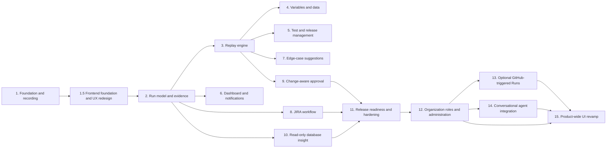

# Sentinel Build Phases

**Status:** Planning baseline  
**Date:** 2026-08-05  
**Source of truth:** [`srd.md`](srd.md) and [`architecture.md`](architecture.md)

## Phase order and dependencies



## Phase 1 — Foundation and guided recording

**Status:** Acceptance criteria verified; owner learning review remains pending.
**Goal:** Prove the smallest useful teach-and-save workflow with named ownership.

### In scope

- Local/development named-user authentication boundary.
- Docker Compose development stack with PostgreSQL, a remote Chromium/noVNC session, and an isolated demo target.
- Product creation and selection.
- Test Case creation with name, website link, product, owner, and timestamps.
- Recording Workspace with a live browser surface and Step Log.
- Basic navigation, click, and text-entry event capture in order.
- Editable step description and expected outcome.
- Inline variable marker stored as metadata, without variable-pool automation yet.
- Save and discard behavior.
- Versioned persistence foundation and audit event for creation.
- One active browser-in-browser recording session against the local sign-in and create-customer demo flow.

### Acceptance checklist

- [x] A named user can sign in using the development identity path.
- [x] A user can create and select a Product.
- [x] A Product creator can rename the Product with blank/duplicate validation and view only that Product's filtered Test Cases.
- [x] **Add New Test** accepts a name and approved website URL.
- [x] The workspace shows the live target and an initially empty Step Log.
- [x] The live browser runs in kiosk app mode, fills the browser stage, and blocks navigation outside the approved demo target.
- [x] A navigation creates a navigation step with timestamp and target context.
- [x] A click creates a click step with target metadata.
- [x] Text entry creates a text step without persisting unredacted secrets by default.
- [x] Steps appear in action order and remain associated with the current Test Case draft.
- [x] A tester can edit description and expected outcome for each step.
- [x] A tester can mark a text value as a variable placeholder.
- [x] Save creates a Test Case linked to exactly one product and named owner.
- [x] Discard leaves no saved Test Case or orphaned draft.
- [x] Refreshing the saved Test Case shows the same ordered steps and annotations.
- [x] Unauthorized users cannot open another product’s Test Case.

### Verification

Run the exact project checks after the toolchain is created:

```text
npm run lint
npm run typecheck
npm test
npx playwright test tests/phase-1-recording.spec.ts
```

The phase is not complete until the commands and raw output are recorded, the acceptance checklist is checked, the diff is reviewed in priority order, and the owner answers the feature’s ten learning questions or records follow-up tasks.

### Deliverables

- Working Phase 1 recording slice.
- Tests for authentication boundary, authorization, step capture, annotation, save, discard, and persistence.
- Updated `learning-log.md` entry with exactly 10 questions.
- Updated `decisions-log.md`, `README.md`, and this checklist.

## Phase 1.5 — Frontend foundation and UX redesign

**Depends on:** Phase 1 functional acceptance
**Status:** Acceptance criteria verified; owner learning review remains pending.
**Outcome:** Sentinel has a coherent, accessible, route-based operations UI for all delivered Phase 1 flows, plus documented visual specifications for future product areas.

### In scope

- A fixed custom CSS token system, CSS-rendered Sentinel mark, local system typography, and reusable frontend primitives.
- Toggleable sidebar and route-based Phase 1 views for sign-in, metrics dashboard, Products, Test Cases, Test Case detail, creation, and Recording Workspace.
- A dark operations interface with purposeful reduced-motion-safe transitions and WCAG 2.2 AA interaction requirements.
- Desktop-first live recording with a narrow-screen guidance state; responsive dashboard and inventory views.
- Documented future UI direction for Runs, Releases, Review, and Settings without placeholder feature implementation.

### Acceptance checklist

- [x] `frontend.md` records all approved visual, interaction, accessibility, responsive, and future-information-architecture decisions.
- [x] Semantic CSS tokens are the only source of implemented UI colours.
- [x] Existing Phase 1 APIs, authorization, persistence, save, discard, and recorder behavior remain unchanged.
- [x] Sign-in, metrics dashboard, dedicated Product creation, Test Case inventory/detail, creation, and Recording Workspace use the route-based App Shell; New recording appears only in the top bar.
- [x] New recording opens as a labelled modal; the active Recording Workspace is chrome-free, gives the Step Log 30% and browser 70% of the desktop workspace, and requires an explicit save/discard decision before leaving.
- [x] Keyboard focus, labels, feedback, non-colour status cues, contrast, and reduced-motion behavior meet the documented WCAG 2.2 AA checks.
- [x] The Recording Workspace remains usable on desktop and clearly guides narrow-screen users to a desktop viewport.
- [x] Playwright verifies new route navigation, keyboard/focus behavior, Product validation feedback, saved-test persistence, recording layout, and narrow-screen guidance.
- [x] Existing lint, type-check, unit, Product creation, and remote-recording tests pass.

### Verification

```text
docker compose exec sentinel npm run lint
docker compose exec sentinel npm run typecheck
docker compose exec sentinel npm test
docker compose exec sentinel npx playwright test tests/product-creation.spec.ts
docker compose exec sentinel npx playwright test tests/phase-1-recording.spec.ts
docker compose exec sentinel npx playwright test tests/frontend-phase-1-5.spec.ts
```

### Deliverables

- `frontend.md` design source of truth and synchronized project documents.
- Token stylesheet, reusable App Shell and component primitives, and redesigned Phase 1 routes.
- Automated and manual desktop, tablet, keyboard, and reduced-motion verification evidence.

## Phase 2 — Run model and complete evidence

**Depends on:** Phases 1 and 1.5
**Status:** Functional acceptance verified; owner learning review remains pending.
**Outcome:** A saved Test Case can produce a locally guided Run record and a Run Detail view with privacy-safe, timeline-linked evidence metadata.

### In scope

- A named, product-authorized tester starts an explicitly guided Run from the current immutable Test Case version and completes the saved steps in strict order inside the existing isolated Demo CRM browser.
- Persist a Run lifecycle (`QUEUED`, `RUNNING`, `COMPLETED`), a nullable outcome (`PASSED`, `FAILED`, `INTERRUPTED`), and separate evidence state (`COMPLETE`, `PARTIAL`). Partial evidence never changes the actual test outcome.
- Create one Run Step Result per saved step. Passing the active step advances; failing captures available failure evidence and safely completes the Run. Skip, pause, cancellation, arbitrary step order, and autonomous replay are deferred.
- Resume the active Run and browser session after a Sentinel page refresh.
- Capture screenshots at Run start, Run end, and failure; redacted network metadata/body snippets; warning/error console messages; and redacted cookie, local-storage, and session-storage metadata at completed-step boundaries.
- Store screenshots in private Docker-local MinIO object storage with checksums. Persist searchable evidence metadata and partial-capture errors in PostgreSQL. Access artifacts only through product-authorized, 15-minute signed URLs.
- Add Run inventory and Run Detail/live guided-workspace views. Only one browser-backed recording or Run is active locally at a time.

### Explicit exclusions

- Do not capture or retain full browser-video recordings for teaching sessions or Runs.
- Do not automatically replay saved actions, add workers/Redis/BullMQ, connect external QA targets, schedule Runs, or add checkpoint/skip behavior. These belong to later phases.

### Acceptance checklist

- [x] An authorized user can start a guided Run from a saved Test Case and its exact current version is retained.
- [x] The Run requires steps to be completed in sequence; pass advances and failure safely ends the Run.
- [x] A page refresh restores an active Run and its remote browser session.
- [x] Passed, failed, and interrupted outcomes persist with timestamps and ordered step results.
- [x] Screenshots, network, console, and storage evidence are linked to the Run timeline without retaining browser video.
- [x] Secret values, cookies, tokens, authorization headers, and sensitive payload fields are redacted before persistence.
- [x] Screenshots are private in MinIO, checksummed, and available only to authorized users through short-lived signed URLs.
- [x] Evidence capture problems are visible as `PARTIAL` without replacing the test outcome.
- [x] A user without Product membership cannot list, inspect, start, or obtain evidence for that Product's Runs.
- [x] Owner manually completes the guided-browser checklist after the automated unit, integration, and Playwright checks pass.

### Verification

```text
docker compose up --build -d
docker compose exec sentinel npm run lint
docker compose exec sentinel npm run typecheck
docker compose exec sentinel npm test
docker compose exec sentinel npx playwright test tests/phase-2-runs.spec.ts
docker compose down
```

## Phase 3 — Autonomous replay engine

**Depends on:** Phases 1–2
**Status:** Implementation and automated acceptance verified; owner learning review pending.
**Outcome:** A saved Test Case can run autonomously in an isolated headless browser, stop safely on uncertainty, and retain the Phase 2 evidence bundle.

### In scope

- Keep the existing guided Run unchanged and add a separate **Auto Run** action.
- Use Redis and BullMQ with one Docker-local worker process that executes at most two Auto Runs concurrently in isolated headless Playwright Chromium contexts.
- Bind every Auto Run to the current immutable Test Case version and create one persistent Run Attempt per execution attempt.
- Replay the allowlisted Demo CRM only. Supply its login credentials through worker-only Docker environment variables; never persist them in a Run, Step Result, evidence item, or browser log.
- Add `GUIDED` and `AUTO` Run modes; queued, running, paused, cancelling, and completed lifecycle states; attempt history; and explicit failure reasons.
- Replay first navigation steps with `goto`; treat later navigation steps as URL milestones so in-page state is preserved.
- Resolve click and text-entry targets only through ordered, exact, unique selector fallbacks: test ID, name/label, role plus exact accessible name, then tag plus exact text. Missing or ambiguous matches fail safely without guessing.
- Treat free-text expected outcomes as human-readable context in evidence and failure reporting, not executable assertions.
- Block an Auto Run when a non-password step has a variable marker, with clear Phase 4 guidance. Existing saved Test Cases remain compatible without re-recording and have no checkpoints unless a new recording marks them.
- Add a checkpoint toggle to draft-step editing. After an Auto Run executes a marked step, capture checkpoint evidence, pause for screenshot/outcome review, and wait up to 10 minutes for Continue or Cancel while retaining the browser context.
- Support explicit cancellation with final available evidence and `INTERRUPTED` outcome.
- Retry exactly once and only for allowlisted technical startup/navigation failures. Preserve the failed attempt and its evidence, then enqueue a linked second attempt. Never retry ambiguity, action failures, checkpoints, cancellation, or user-visible test failures.
- Capture screenshots at start, end, failure, and checkpoints plus the existing redacted network, warning/error-console, and storage evidence. Full browser video remains prohibited.
- Compare successful Auto Run active duration, excluding queue, checkpoint, and retry wait time, to the median duration of the latest three successful guided Runs of the same Test Case version. Show benchmark unavailable when fewer than three exist; do not fail the Run for that reason.

### Acceptance checklist

- [x] A product-authorized tester can queue an Auto Run separately from a guided Run.
- [x] Redis/BullMQ persists queued Auto Runs and the worker processes at most two isolated Playwright contexts concurrently.
- [x] An Auto Run executes the Demo CRM sign-in and customer journey without tester interaction and produces the Phase 2 evidence bundle without video.
- [x] Password credentials never appear in persisted steps, attempts, evidence, logs, or API responses.
- [x] Existing saved Test Cases replay without re-recording; a variable-marked non-password step blocks only Auto Run with clear Phase 4 guidance.
- [x] Unique exact selector fallbacks recover supported cosmetic selector changes; missing or multiple matches stop safely with an explicit reason.
- [x] A checkpoint pauses after its marked action, shows checkpoint evidence and expected outcome context, resumes within 10 minutes, or interrupts safely on timeout/cancel.
- [x] An explicit cancellation captures final available evidence and never retries.
- [x] Exactly one technical retry is linked to the original Run; non-technical failures never retry.
- [x] Auto Run duration is compared against the defined three-guided-Run median when available.
- [x] Product authorization protects Auto Run queueing, inspection, resume, cancel, attempts, and evidence access.
- [x] Guided Run behavior, single noVNC browser isolation, and Phase 1–2 acceptance remain unchanged.

### Verification

```text
docker compose up --build -d
docker compose exec sentinel npm run lint
docker compose exec sentinel npm run typecheck
docker compose exec sentinel npm test
docker compose exec sentinel npx playwright test tests/phase-3-auto-runs.spec.ts
docker compose exec sentinel npx playwright test tests/phase-2-runs.spec.ts
docker compose exec sentinel npx playwright test tests/phase-1-recording.spec.ts
docker compose down
```

Automated verification on 2026-08-11 covered the six-file, 19-test Vitest suite; the Phase 1 browser-lock, Product creation, recording, and frontend regressions; the Phase 2 guided-Run regression; and the Phase 3 Auto Run browser flow. The ten Phase 3 owner questions in `learning-log.md` remain an explicit follow-up, so the phase is not yet marked fully understood.

### Deliverables

- Redis/BullMQ queue and two-concurrency Playwright worker.
- Auto Run persistence, API, controls, attempt history, checkpoint review, cancellation, retry, and duration comparison.
- Selector-resolution and replay engine with privacy-safe evidence reuse.
- Phase 3 automated and manual acceptance evidence plus a learning-log entry with exactly 10 questions.

## Phase 4 — Variables and test-data lifecycle

**Depends on:** Phase 3  
**Status:** Implementation and automated acceptance verified; owner learning review pending.
**Outcome:** Variable-marked Test Cases can run safely with encrypted static, pooled, or manual values in either Guided or Auto mode.

### In scope

- Canonical shared variable names, encrypted static defaults, encrypted per-Run bindings, and placeholders in recorded/saved steps.
- A Docker-local, product-scoped Test Data Set pool with encrypted keyed fields, `REUSABLE` (default) and `SINGLE_USE` policies, and `SAFE`, `RESERVED`, `CONSUMED`, and `INVALID` lifecycle states.
- Product-member Test Data management, invalidation, replacement, audit events, and masked list/detail responses.
- A Test Case variable-configuration section and a pre-run binding form for both Guided and Auto Runs.
- Atomic local-pool field-completeness, authorization, and reservation checks. Reusable data releases after every terminal outcome; single-use data is consumed only after Passed and otherwise releases.
- Guided and Auto substitution from server/worker-only encrypted bindings. Auto retries reuse the original binding.
- A safe migration of existing variable-marked steps and rejection of secret-like variable values. Existing server-only password handling remains separate.

### Explicit exclusions

- External test-data adapters, QA PostgreSQL state validation, database writes, secrets management beyond existing server-only credentials, scheduling, releases, JIRA, and notifications.

### Acceptance checklist

- [x] Variable values are encrypted at rest and raw values do not appear in saved steps, API detail responses, Run Detail, evidence, logs, queues, or audit text.
- [x] Static, pool, and manual sources work for both Guided and Auto Runs; repeated variable names resolve to one shared value.
- [x] Product members can create, replace, list, and invalidate local Test Data Sets without reading persisted raw values.
- [x] Run creation atomically reserves only an eligible safe data set that provides all required fields.
- [x] A selected data set is reserved exclusively while its Run is active. Reusable data returns to safe after every terminal outcome; single-use data is consumed only after Passed and otherwise returns to safe. Existing consumed data migrates to safe reusable data.
- [x] Auto retries and refresh recovery reuse the same encrypted Run binding.
- [x] Secret-like values are rejected and password replay remains server-only.
- [x] Unauthorized users cannot manage another Product’s data or inspect its bindings.
- [x] Unit, integration, browser, and Phase 1–3 regression checks pass; the learning record has exactly ten Phase 4 owner questions.

### Verification

```text
docker compose up --build -d
docker compose exec sentinel npm run lint
docker compose exec sentinel npm run typecheck
docker compose exec sentinel npm test
docker compose exec sentinel npx playwright test tests/phase-4-variables.spec.ts
docker compose exec sentinel npx playwright test tests/phase-1-recording.spec.ts
docker compose exec sentinel npx playwright test tests/phase-2-runs.spec.ts
docker compose exec sentinel npx playwright test tests/phase-3-auto-runs.spec.ts
docker compose down
```

Automated verification on 2026-08-13 passed Docker lint and type-check; the complete Vitest suite including variable encryption, manual/pool lifecycle, Auto replay, and Guided variable substitution; and the Phase 1 recording, Phase 2 guided Run, Phase 3 Auto Run, and Phase 4 variable browser flows. The owner must still answer the exactly ten Phase 4 questions in `learning-log.md` before the phase is considered fully understood.

The 2026-08-14 Test Data reuse-policy adjustment passed Docker lint and type-check, Test Data API lifecycle/concurrency coverage, and the Phase 4 browser flow for reusable and single-use data. The owner must still answer the Phase 4 learning questions before the phase is considered fully understood.

### Deferred follow-up

- Add non-blocking variable-name suggestions for likely email, ID, and order-number fields only after the recorder can reliably capture a settled field value without generating one recorded step per keystroke. Testers enter variable names manually until then.

## Phase 5 — Test Case and release management

**Depends on:** Phase 3  
**Outcome:** Testers can organize Test Cases, save safe edits as immutable versions, and batch-run release-ready Auto Tests.

### Acceptance checklist

- [x] Product members can add and remove multiple product-local feature labels while editing a Test Case; Test Case inventory filters by label.
- [x] `/test-cases/[id]/edit` starts from the current immutable version and may update labels, descriptions, expected outcomes, checkpoints, and non-secret text-entry variable markers without changing the recorded target metadata, literal/redacted values, step order, or kind. A changed browser action requires a new recording.
- [x] Saving an edit creates Version 2 or later atomically, keeps the Test Case owner unchanged, preserves every prior version and its Runs, updates `currentVersion`, and writes an audit event.
- [x] Test Case Detail exposes current and earlier read-only versions plus the version’s Run history.
- [x] A product member can create a named Release and manage it only when they belong to every Product represented by its Test Cases; duplicate tags and empty batch starts fail clearly.
- [x] A Release Run snapshots the current immutable version of every tagged Test Case at start and retains the snapshot when the Release changes later.
- [x] Batch execution creates linked Auto Runs through the existing two-concurrency worker. Checkpointed Test Cases and variables without encrypted static defaults are persisted as excluded items with clear reasons.
- [x] Release readiness is `In progress` while work remains, `Ready` only when every item passes, and `Not ready` for a failed, interrupted, or excluded item.
- [x] Individual Guided and Auto Runs retain their current APIs and behavior.
- [x] Authorization protects labels, versions, Releases, Release Runs, and linked Run/evidence paths across Products.

### Verification

```text
docker compose up --build -d
docker compose exec sentinel npm run lint
docker compose exec sentinel npm run typecheck
docker compose exec sentinel npm test
docker compose exec sentinel npx playwright test tests/phase-5-release.spec.ts
docker compose down
```

Manual verification: add two labels; save one safe step edit as Version 2; confirm Version 1 and its old Runs remain unchanged; create a cross-product Release as a member of both Products; start a batch; inspect its snapshot, linked Auto Runs, exclusions, and derived readiness; then sign in as a user missing one Product and confirm Release access is rejected.

**Implementation verification (2026-08-15):** Docker applied `20260815090000_add_test_case_versions_and_releases`; lint and type-check passed; the full Vitest suite passed including `tests/release-api.test.ts`; and all ten Playwright specs passed including `tests/phase-5-release.spec.ts`. The targeted API test verifies immutable Version 2 creation, label persistence, cross-product membership denial, explicit checkpoint exclusions, a successful linked Auto Run item, and derived `READY`/`NOT_READY` states. The browser flow verifies labels, inventory filtering, Release creation, and visible batch exclusion feedback.

**Deferred:** schedules, notifications, JIRA, approval workflow, Guided batch execution, manual/pool Test Data batch binding, external targets, and automatic database cleanup remain out of scope.

## Phase 6 — Dashboard and notifications

**Depends on:** Phase 2 and Phase 5  
**Status:** Implementation and automated acceptance verified; owner manual review and learning review pending.
**Outcome:** A product-authorized user can understand the recent health of their Tests and Releases, find instability, and reliably receive only safe, actionable failure/checkpoint/Release notices.

### In scope

- Replace the coverage-only dashboard source with `GET /api/dashboard`, optionally filtered by Product.
- Show an all-accessible-Products overview and Product drill-down using a fixed rolling 30-day UTC window: saved Test Cases, completed Runs, pass rate (`Passed / (Passed + Failed)`, excluding interrupted), failed count, flaky current versions, coverage change against the preceding 30 days, and latest completed Run per Product.
- Show a selected Product's daily Passed/Failed trend, coverage change, linked flaky Tests, and unread failure/checkpoint items needing attention. Use custom CSS rather than a chart library.
- Persist a per-recipient Notification with type, delivery state, Product/Run/Release references, creation/sent/read timestamps, attempts, and a safe error summary.
- Add an authorized `/notifications` inbox with unread/all filtering, individual and bulk read actions, delivery state, and protected Run or Release links.
- Notify the Test Case owner and Run initiator of failed Runs; notify those same users for Auto Run checkpoints; notify the Release owner and batch initiator once each when a Release Run completes. De-duplicate recipients and retain individual failed-Test owner notices.
- Add Docker-local Mailpit. Persist before queueing email delivery through the existing worker's dedicated BullMQ notification queue. Retry transient SMTP failure once, then mark final delivery failure and audit it.
- Send email summaries containing only safe Product/Test or Release/state/timestamp/reason/link information. Never email evidence, screenshots, raw logs, variables, credentials, tokens, cookies, or browser data.

### Explicit exclusions

- Historic notification backfill, notification preferences, digests, deletion, Slack, real email-provider credentials, pending-approval notices before Phase 9, user-specific time zones, and changes to Run outcomes, evidence status, or Release readiness caused by delivery failure.

### Acceptance checklist

- [x] An authorized user can view an all-accessible-Products overview and safely drill into one Product.
- [x] Dashboard metrics use exact rolling 30-day UTC boundaries and the documented pass-rate, flaky-version, coverage-growth, and latest-Run definitions.
- [x] A user cannot retrieve dashboard data, flaky links, notifications, Runs, or Releases outside current Product membership.
- [x] Failed Run and Auto Run checkpoint events create de-duplicated per-recipient notifications only for new Phase 6 events.
- [x] Completed Release Runs create one consolidated summary per Release owner/batch initiator, without suppressing relevant individual failed-Test owner notices.
- [x] Inbox unread/all filtering and individual/bulk read state persist and audit correctly.
- [x] Mailpit receives only safe summary email with a protected Sentinel link.
- [x] One transient delivery failure retries once; a second failure becomes an audited failed delivery without changing factual Test or Release state.

### Verification

- Unit tests cover UTC window boundaries, pass rate, flakiness, coverage growth, recipient de-duplication, safe email rendering, and retry classification.
- Integration tests cover Product authorization, persisted notification delivery, Mailpit, final failure, Release summary aggregation, read state, and notification failure independence.
- Browser tests cover dashboard overview/drill-down and empty states, flaky links, attention items, inbox filters/read actions, failure/checkpoint notifications, and Mailpit-safe links.
- Manual verification creates Passed, Failed, Interrupted, and checkpointed Runs; inspects dashboard values and Mailpit at `http://localhost:8025`; confirms safe email content; and confirms one Release summary instead of one email per failed batch item.

**Implementation verification (2026-08-20):** Docker applied `20260820110000_add_notifications` and `20260820110500_deduplicate_notifications`; lint and type-check passed. All 11 Vitest files passed in serial verification groups (33 tests), including Phase 6 dashboard/notification unit and integration coverage. All 11 Playwright browser checks passed in serial groups, including `tests/phase-6-dashboard-notifications.spec.ts`. The automated checks cover 30-day UTC health definitions, membership denial, safe Mailpit delivery, unread/read state, checkpoint and Release-summary recipient de-duplication, retry/final delivery failure behavior, and the Phase 1–5 regressions. Owner manual inspection of dashboard values and Mailpit content, plus the Phase 6 learning review, remain pending.

## Phase 7 — Edge-case and negative-test suggestions

**Depends on:** Phase 3 and Phase 5  
**Status:** Implementation and automated acceptance verified; owner manual and learning reviews pending.
**Outcome:** A product member can explicitly generate conservative, reviewable negative-Test drafts from a current saved Test Case version, then approve one into an independent Test Case without changing the source or starting a Run.

### In scope

- A deterministic Docker-local rule engine, not an LLM, runs only when a product member selects **Generate suggestions** on a saved Test Case.
- The generator snapshots the current immutable source version and considers only non-secret, non-variable text-entry steps with captured validation metadata. It proposes blank required inputs, invalid email values, and one-character-outside known minimum/maximum boundaries.
- The Demo CRM records first/last-name 2–50-character metadata and supplies those validation constraints, so Phase 7 can demonstrate one- and 51-character boundary drafts.
- Passwords, redacted steps, variables, unsupported controls, and fields lacking relevant validation metadata are skipped and reported with a clear reason.
- A central `/review` queue and a Test Case detail link support Product/status filtering and Draft, Approved, and Dismissed history.
- A Draft may change only title, rationale, and its safe proposed text value. Target metadata, step order/kind, password behavior, and variable behavior remain immutable.
- One persistent draft exists per source version, source step, and rule. Repeat generation is idempotent; a dismissed item remains historical and may be deliberately reopened.
- Approval atomically creates a separately owned Test Case with independent Version 1, copies labels and safe variable configuration, changes only the proposed text step, links the source suggestion, and writes an audit trail. The approver is the derived Test Case owner.

### Explicit exclusions

- Generated Tests never run, queue, notify, file JIRA work, alter a baseline, or connect to external targets before and after approval in this phase.
- LLM generation, broad heuristic guessing, automatic variables, arbitrary metadata edits, external validation, scheduling, releases, and Phase 9 change proposals remain out of scope.

### Acceptance checklist

- [x] An authorized product member can manually generate only the documented deterministic missing-required, invalid-email, and boundary suggestions from the current source version.
- [x] Ineligible password, redacted, variable-backed, unsupported, and metadata-free fields are skipped without leaking their values.
- [x] Regeneration creates no duplicate source-version/step/rule suggestion and preserves Dismissed history for manual reopen.
- [x] Product authorization protects generation, Review queue/detail, draft editing, approval, dismissal, reopening, and derived Test Case links.
- [x] A Draft can change only name, rationale, and safe value; secret-like proposed values are rejected.
- [x] Approval creates an independent approver-owned Test Case Version 1 in one transaction; source Test Case, its historical versions, and Runs stay unchanged.
- [x] A suggestion has no Run before approval, and approval does not auto-run it or change a baseline.
- [x] Unit, integration, browser, and Phase 1–6 regression checks pass; `learning-log.md` has exactly ten Phase 7 owner questions.

### Verification

```text
docker compose up --build -d
docker compose exec sentinel npm run lint
docker compose exec sentinel npm run typecheck
docker compose exec sentinel npm test
docker compose exec sentinel npx playwright test tests/phase-7-suggestions.spec.ts
docker compose down
```

Manual verification: record/save a fresh Demo CRM happy-path Test; select **Generate suggestions**; inspect the Review queue; edit and approve one safe draft; confirm the approver owns an independent Version 1 and neither Test has started a Run; dismiss and reopen another draft; then sign in as a user without the Product and confirm queue/action access is denied.

**Implementation verification (2026-08-20):** Docker applied `20260820130000_add_test_suggestions`; lint and type-check passed. All 12 Vitest files (35 tests) passed in serial verification groups, including `tests/suggestions.test.ts` for deterministic rule generation, skip reasons, idempotency, safe edits, approval cloning, audit history, and authorization. All 10 Playwright specs (12 tests) passed in serial groups, including `tests/phase-7-suggestions.spec.ts` for Generate suggestions, Review, edit, approve, dismiss, and reopen flows. The rebuilt local Demo CRM includes first/last-name 2–50-character validation metadata. Owner manual acceptance and the Phase 7 learning review remain pending.

## Phase 8 — JIRA bug workflow

**Depends on:** Phase 2 and Phase 6  
**Outcome:** An authorized Product member can review and explicitly file a privacy-safe Jira Cloud Bug for a failed Run, or update that Test Case's existing open Bug.

### In scope

- A server-only Jira Cloud adapter and one creator-managed Jira project-key mapping per Product.
- A failed-Run review draft with editable safe summary, reproduction description, and priority; Jira issue type remains Bug.
- Protected Sentinel Run Detail links, ordered immutable-version reproduction steps, Product/Test context, and safe failure reason only.
- One open Jira issue per Test Case; later failed Runs update its open issue with a safe comment and a new protected Run link.
- Durable per-Run filing state, one transient retry, final safe error state, audit events, and Run Detail status.

### Explicit exclusions

- Automatic filing, passed/interrupted-Run filing, Jira attachments, Jira Server/Data Center, arbitrary Jira project fields, Slack, GitHub triggers, and Phase 9 approval routing.

### Acceptance checklist

- [ ] A Product creator can configure, validate, replace, and remove only their Product's Jira project mapping.
- [ ] A current Product member can create and safely edit a draft for a completed failed Run, but cannot file from a passed or interrupted Run.
- [ ] Filing creates a Jira Cloud Bug with only safe text and a protected Sentinel Run Detail link.
- [ ] A later failed Run for the same Test Case updates its existing open Jira issue; a Jira Done issue permits a new Bug.
- [ ] Refreshes, duplicate clicks, job retries, and simultaneous filing requests cannot create duplicate Jira side effects for one Run.
- [ ] One transient Jira failure retries once and final failure remains visible without changing Run outcome, evidence status, Release readiness, or notification state.
- [ ] Product authorization protects mappings, filing drafts, filing status, and linked Run access.
- [ ] Unit, integration, browser, and Phase 1–7 regression checks pass; `learning-log.md` has exactly ten Phase 8 owner questions.

### Verification

Run Docker lint, type-check, full Vitest and Playwright suites. Use a mocked Jira Cloud adapter for automated create/update/retry coverage. When server-only Jira credentials are configured, manually map a Product, fail a Run, review and file the Bug, confirm Jira contains only safe text/protected Sentinel links, then fail that Test Case again and verify the original open issue receives a comment.

## Phase 9 — Change-aware approval

**Depends on:** Phases 3, 6, and 8  
**Outcome:** Intentional changes are proposed to the original owner without silent baseline updates.

### Implemented scope

- A current Product member may create and submit one proposal from a completed failed Run after entering known-deployment context.
- A proposal may change only saved-step description and expected outcome. Actions, target metadata, values, variables, checkpoints, order, kinds, and labels are read-only.
- Review shows side-by-side source/proposed annotations and a protected failed-Run evidence link.
- Only the Test Case's original owner can approve or reject a submitted proposal. Approval clones the source into the next immutable Test Case version; old versions and Runs remain unchanged.
- Approval is blocked and the proposal becomes `STALE` if the Test Case current version changed after proposal creation.
- Rejection creates an editable Phase 8 Jira draft only when the Product has a Jira mapping; it never files automatically.
- Submission notifies the owner. Approval/rejection notifies the owner and creator, using the existing in-app/Mailpit safe-delivery path.

### Acceptance checklist

- [x] Failed-Run-only proposal creation and Product authorization are enforced.
- [x] Proposed text rejects secret-like content and cannot mutate replay behavior.
- [x] Owner-only approval produces the next immutable Test Case version atomically.
- [x] Stale proposals cannot overwrite a newer baseline.
- [x] Rejection leaves an unfiled Jira draft when a mapping exists.
- [x] Proposal notification recipients are de-duplicated and email contains safe summary text only.
- [x] Focused Docker API/database verification covers approval, authorization, stale protection, and Jira-draft state.
- [ ] Owner manual review and Phase 9 learning questions remain pending.

### Deferred

- Automatic deployment detection, Git/GitHub correlation, automatic change classification, merge/conflict resolution, automatic Jira filing, and changes to action/selector/value semantics.

## Phase 10 — Read-only database insight

**Depends on:** Phase 2 and confirmed database access  
**Outcome:** A completed failed Run can include safe, relevant, explicit QA customer-state context without granting Sentinel database write access.

- [x] Add the local `qa-postgres` fixture database and Demo CRM customer-write fixture API, isolated from Sentinel's application PostgreSQL.
- [x] Provision distinct fixture writer and Sentinel diagnostic roles; automatically verify the diagnostic role can select but cannot insert, update, delete, or create schema objects.
- [x] Define one allowlisted `customer_lookup_by_email` query. Derive its lookup value transiently from the final eligible non-secret email step or encrypted Run binding; never accept an email from the UI.
- [x] Restrict the query to a parameterized one-row `qa_customers` lookup in a read-only transaction with a 1.5-second timeout.
- [x] Persist only found/not-found state, customer status, and timestamps as database-diagnostic and `DATABASE` evidence; persist safe incomplete/unavailable codes for failures.
- [x] Add a Product-authorized, explicit Run Detail action for completed failed Runs. Never display or persist the lookup email, raw row, SQL, or credentials.
- [x] Include only the safe completed diagnostic summary in a later reviewed Jira draft; never create or file Jira work automatically.
- [x] Add focused Docker tests for email selection/redaction, read-only role verification, fixture lookup, and safe found/not-found metadata.
- [ ] Run full lint, type-check, full Vitest, Phase 1–9 regression, manual Run Detail, and learning review before calling Phase 10 acceptance complete.

**Out of scope:** Generic SQL, QA-database writes, external QA-database connections, automatic failed-Run diagnosis, raw-row browsing, automatic Jira filing, and notifications based on diagnostic results.

## Phase 11 — Release readiness and hardening

**Depends on:** Phases 4–10  
**Outcome:** The Docker-local platform is ready for a controlled internal pilot, with explicit operational limits and recovery evidence.

- [x] Keep the pilot local-only: bind Sentinel, Demo CRM, and noVNC to localhost; retain seeded named users; document that production identity and roles remain a launch blocker.
- [x] Add independent Product/Test Case/Release ownership transfer for eligible members, Product-creator authorization, submitted-proposal rerouting, confirmation UI, and audit events.
- [x] Resolve evidence retention as 30 days. Delete expired completed-Run MinIO objects before detailed Evidence records, delete completed database diagnostics, skip active Runs, and retain failed object deletions for retry.
- [x] Record startup/daily retention outcomes and a Redis worker heartbeat; expose safe service, retention, and optional-Jira state on the authenticated Dashboard readiness panel.
- [x] Honor optional Jira HTTP 429 `Retry-After` once, capped at 60 seconds, without altering factual Run, evidence, Release, or notification state.
- [x] Add focused Docker coverage for transfers, proposal reassignment, retention, readiness authentication, and rate-limit parsing.
- [x] Re-run full lint, type-check, Vitest, Playwright, Docker startup, concurrency/retry/denial checks, and automated readiness verification. Owner manual readiness verification remains pending.
- [x] Publish an adversarial review and explicitly defer each wider-deployment finding.
- [ ] Complete deferred owner learning answers before calling the platform fully understood.

## Phase 12 — Organization roles and administration

**Depends on:** Phase 11 and an approved identity/authentication decision.
**Outcome:** Sentinel has an organization-aware authorization boundary in which approved administrators can manage membership and roles, while every existing Product, Test Case, Run, Release, evidence, variable, Jira, and diagnostic action remains protected by explicit permissions.

- [x] Confirm the built-in local account model, invitation/deprovisioning flow, eight-hour server-managed session policy, and bootstrap organization rule. Production identity providers remain out of scope.
- [x] Document and implement the Admin, Manager, and Tester permission matrix for Product access, Test Data, Runs, Releases, Jira configuration, approvals, and ownership transfer.
- [x] Add organization, membership, role-assignment, secure account/session persistence, and a controlled bootstrap that preserves pilot users, Products, Test Cases, Runs, Releases, evidence, Test Data, Jira mappings, diagnostics, notifications, and audit history.
- [x] Build Admin-only membership management: invite a new account through Mailpit, add an existing account, set role/Product access, disable/reactivate accounts, revoke sessions, and retain history.
- [x] Enforce organization/Product authorization for current API and dashboard/Run/Release/Review paths; disabled accounts lose their server-managed sessions immediately.
- [x] Define the individual-project workspace rule: its first controlled bootstrap user is an Admin within its isolated organization.
- [x] Provide the Administration route for member state, role, Product access, and safe administration data without exposing credentials, variable values, or evidence bodies.
- [x] Add focused account-helper tests and live Docker acceptance checks for sign-in, Admin denial, Manager Product creation, invitation acceptance, and immediate session revocation. Remaining broader Playwright permission-matrix coverage is tracked as a hardening follow-up.
- [x] Update required documentation and add an append-only learning-log entry with exactly 10 owner questions. Owner manual authorization testing is now ready.

**Out of scope:** SSO/SAML/SCIM implementation unless selected during the approval gate, billing, self-service public signup, arbitrary custom roles, and production deployment.

## Phase 13 — Optional GitHub connection and branch-triggered Runs

**Depends on:** Phase 12 and an approved GitHub authentication model.
**Outcome:** An authorized organization can optionally connect a Product to approved GitHub repositories and branches so qualifying pushes start only explicitly eligible Auto Runs, with safe traceability and no effect on unconnected Products.

- [ ] Confirm GitHub App versus OAuth, repository-installation ownership, required GitHub permissions, webhook endpoint/deployment boundary, and disconnect/revocation behavior before implementation.
- [ ] Let only the approved organization/Product authority create, view, pause, edit, or remove a connection. Store repository identifiers, selected branch rules, and safe connection state; never store GitHub tokens in browser-visible data or audit detail.
- [ ] Verify webhook signatures, enforce repository and branch allowlists, reject replayed/stale events, and persist a de-duplicated delivery record before any Run is queued.
- [ ] Define and display an explicit Test Case eligibility policy. At minimum, a source-control event must not bypass existing Auto Run safeguards for checkpoints, variable/Test Data bindings, Product authorization, concurrency, or browser-target allowlists.
- [ ] Queue eligible Runs through the existing worker with bounded concurrency, link every queued Run to the GitHub delivery and commit metadata, and preserve normal retries, evidence redaction, outcomes, and notifications.
- [ ] Provide a Product-level connection screen and a safe activity view showing branch, commit identifier, trigger decision, excluded Tests/reasons, queued Runs, pause state, and protected Run links; never display source code, tokens, or raw webhook payloads unnecessarily.
- [ ] Define idempotent retry and failure behavior for webhook receipt and Run queueing. A failed webhook or worker delivery must not create duplicate Runs or grant access.
- [ ] Add unit, integration, webhook-signature, queue, authorization, and browser tests for connected versus unconnected Products, branch filtering, duplicate delivery, pause/disconnect, ineligible Tests, and safe notifications/audit history.
- [ ] Update all required documentation, add an append-only learning-log entry with exactly 10 owner questions, run full regression, and complete owner manual GitHub sandbox testing.

**Out of scope:** GitHub source-code analysis, automatic baseline/Test Case modification, arbitrary workflow automation, pull-request approval, automatic Jira filing, and connections to non-GitHub source-control providers.

## Phase 14 — Conversational agent integration

**Depends on:** Phase 12; may reuse Phase 13 Run traceability but must not require a GitHub connection.
**Outcome:** An explicitly linked, authorized tester can safely use an approved WhatsApp or Telegram integration to discover Tests/Releases, request eligible Auto Runs, confirm the request, and receive a privacy-safe result without opening Sentinel on a laptop.

- [ ] Confirm the first messaging provider, provider account ownership, webhook/authentication model, message-retention policy, identity-linking flow, and support/runbook before implementation. WhatsApp and Telegram are alternatives until the owner approves scope.
- [ ] Require a one-time, authenticated Sentinel identity link and re-check current organization, role, and Product access for every command. A phone number, chat ID, or forwarded message alone must never authorize an action.
- [ ] Support a deliberately narrow command flow: list authorized Releases/Test Cases, select one or more eligible Tests, show a clear confirmation including scope, then request existing Auto Runs. Do not expose a generic administrative command surface.
- [ ] Reuse existing Auto Run eligibility, variable/Test Data binding rules, checkpoints, queue limits, cancellation, retry, authorization, evidence redaction, and audit boundaries. Ineligible Tests must return a clear safe reason rather than being silently skipped.
- [ ] Send only privacy-safe chat replies: names, states, timestamps, safe failure reason, and protected Sentinel links. Never send credentials, variables, Test Data values, screenshots, raw logs, evidence URLs, database results beyond existing safe summaries, or unrestricted Run controls.
- [ ] Make inbound messages and outbound status notifications idempotent, rate-limited, auditable, and recoverable from provider/worker failures. Explicitly define confirmation expiry and how cancellation is authorized.
- [ ] Provide a Sentinel integration/status screen for administrators: linked identities, safe connection status, last command state, revoke/unlink action, and audit history without message or secret leakage.
- [ ] Add unit, integration, provider-webhook, queue, authorization, redaction, confirmation, retry, and browser tests—including revoked access, stale confirmation, duplicate message, unauthorized chat, and failed-provider cases.
- [ ] Update all required documentation, add an append-only learning-log entry with exactly 10 owner questions, run full regression, and complete owner manual sandbox-provider testing.

**Out of scope:** Unrestricted natural-language administration, autonomous Test selection, direct evidence delivery in chat, production customer support, multi-provider implementation in the first iteration, and bypassing Sentinel's approved browser/Run policies.

## Phase 15 — Product-wide UI/UX revamp

**Depends on:** Phase 12 for the currently delivered product. The owner approved beginning this work before optional Phases 13–14 on 2026-08-24; their future screens must adopt the resulting system later.
**Outcome:** The delivered Sentinel product has a cohesive, modern, accessible, and understandable experience across administration, recording, testing, Runs, Releases, Review, evidence, and notifications—without changing approved business/security behavior accidentally.

- [x] Complete repository and live-interface discovery for the currently delivered Phase 12 product. The owner approved the resulting route-by-route redesign blueprint on 2026-08-24; broader representative-user usability research remains a post-implementation validation activity.
- [x] Audit every current route, modal, empty/loading/error state, protected action, focus order, responsive state, and operational workflow. The approved blueprint records the current problems and intended hierarchy.
- [x] Define the revised visual language, design tokens, typography, colour/contrast roles, component states, internal SVG icon strategy, motion rules, accessibility specification, and content guidelines in `frontend.md`.
- [x] Redesign the application shell, navigation, Dashboard, Product/administration areas, Test Cases, recording workspace, Run/evidence detail, Releases, Review, and notifications as one coherent system. GitHub settings/activity and conversational-integration management remain unimplemented optional Phase 13–14 surfaces; they must adopt this system rather than receiving placeholder UI.
- [x] Preserve all authorization visibility rules, protected links, destructive-action confirmations, privacy-redaction cues, desktop recording constraints, and existing keyboard/reduced-motion behavior while improving clarity and speed. Existing API paths and payloads were not changed.
- [x] Validate responsive behavior against the agreed policy. The shell becomes a drawer below 64rem, dense grids collapse, dialogs become viewport-safe, and Recording/Guided Run workspaces retain their explicit wider-screen guidance. Automated coverage verifies the 900px recording boundary and zero-duration reduced-motion behavior.
- [ ] Add visual, keyboard, accessibility, route/navigation, error-feedback, and end-to-end regression coverage for every existing critical workflow; verify that the redesign does not alter API contracts, persisted data, Run behavior, or security boundaries. Current evidence: production build passes all 18 routes; focused redesigned Playwright flows pass; serial Vitest passes 43/45. The two remaining Guided Run assertions are correctly blocked by an existing user-owned `RUNNING` Guided Run and must be rerun after that Run is resolved through the product workflow.
- [ ] Conduct owner usability testing, record findings and approved refinements, then update all required documentation and add an append-only learning-log entry with exactly 10 owner questions.

**Out of scope:** New business features, replacing the browser automation/evidence architecture, changing role policy, a native mobile application, or styling-only changes without the approved UX discovery and accessibility review.
