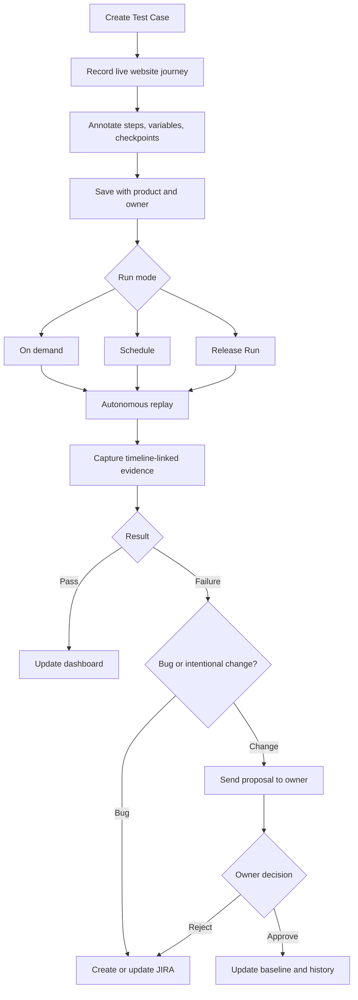

# Sentinel Software Requirements Document

**Version:** v1.0 planning baseline  
**Date:** 2026-08-05  
**Source:** `sentinel-detailed-requirements.md`

## 1. Product summary

Sentinel lets a person teach a browser-based test journey once, save it as a product-owned Test Case, replay it autonomously, and inspect a complete evidence bundle for every Run. Human approval remains required for checkpoints, proposed expectation changes, and other consequential decisions.

## 2. Scope

### In scope

- Multiple internal web products in the QA environment.
- Ten concurrent named users initially.
- Organization-level shared login and individual logins, with named ownership retained.
- Guided recording, replay, evidence capture, data variables, negative-test suggestions, test/release management, dashboards, notifications, JIRA, change approval, and read-only PostgreSQL insight.

### Out of scope for v1

- iOS and Android testing.
- Any database write or delete access.
- Migration of existing automated tests.
- Source-control integration for root-cause correlation.

## 3. Users, roles, and ownership

| User or role | Required capability |
|---|---|
| Tester or feature expert | Create, teach, edit, run, inspect, and manage tests for products they can access. |
| Test owner | The person who created a Test Case; owns it and approves expected-behavior changes. |
| QA lead | Organize products and releases, trigger release runs, and review consolidated readiness. This is a capability, not a replacement for per-test approval. |
| Developer | Inspect evidence, understand failures, and use JIRA output; may teach a test when they understand the feature. |
| Product manager | May teach or inspect a test when appropriate. |

Every Test Case stores its product, owner, creation timestamp, and change history. Shared authentication must not erase the individual actor identity.

## 4. Domain terms

- **Test Case:** A named, reusable journey taught by a person.
- **Step:** One recorded action or checkpoint in a Test Case.
- **Run:** One execution of a Test Case, whether manual-triggered, scheduled, or part of a Release Run.
- **Evidence Bundle:** Privacy-safe screenshots, network, console, storage, and later database context associated with a Run. Full browser video is intentionally excluded.
- **Variable:** A value that is static, pooled, or supplied per Run.
- **Checkpoint:** A step where automation pauses for human confirmation.
- **Release Run:** A batch execution of all Test Cases tagged to a release.

## 5. Product journey

## 6. Functional requirements

### F1. Guided test creation and recording

1. The dashboard provides **Add New Test**.
2. The creation form requires Test Name and Website Link and associates the selected product and current named owner.
3. The Recording Workspace shows an interactive live website beside a real-time plain-English Step Log.
4. Clicks, text entry, navigation, and page loads create step entries automatically.
5. Each step can be edited and can contain a description, expected outcome, conditional instruction, checkpoint flag, and important-screenshot flag.
6. Typed values can be marked inline as variables.
7. The tester can save at any point or discard the recording without creating a Test Case.
8. A named user can create a Product with a required unique name, rename a Product they created using the same validation, and open the Test Case inventory pre-filtered to that Product. Product names are trimmed; blank and duplicate names are rejected with clear feedback.
9. During Phase 1 recording, the embedded browser is locked to the approved demo target. Browser chrome and host WebDriver access are unavailable to the tester, and off-target navigation is blocked by managed browser policy.

### F2. Complete evidence capture

Every Run must persist its outcome, timestamps, step results, linked evidence, and a separate indication when evidence capture was partial. A teaching session persists its recorded steps, not a browser-video recording.

For every Run, capture and retain the applicable evidence bundle:

- Network requests and responses with endpoint, status, timing, payload, and slow/error highlighting.
- Timestamped console output, including errors and warnings.
- localStorage, sessionStorage, and cookie state at step boundaries.
- Screenshots at start, end, failure, and—when later implemented—explicitly flagged steps.

Full browser-video recordings must not be captured or retained. Phase 2 provides an explicitly tester-guided Demo CRM Run: the tester approves saved steps in strict order, and Sentinel applies each approved step visibly in the isolated browser before marking it passed. The tester can fail the active step instead. This is reviewed, step-by-step replay rather than an autonomous Run: it has no queue, retry, checkpoint, or unattended execution. All evidence is accessible from one Run Detail view and is timeline-linked to the Step Log for passed, failed, and interrupted Runs.

### F3. Autonomous replay

- Preserve Phase 2 Guided Run and offer a separate product-authorized Auto Run action.
- Run a saved Test Case without a human present unless a checkpoint is reached, using an isolated headless browser context.
- For the Docker-local Demo CRM, use server-only worker credentials; never persist credentials in a Run or evidence bundle.
- Replay the initial navigation, then execute recorded text and click actions. Later navigation records are URL milestones and must not reload in-page state.
- Tolerate limited cosmetic change only through ordered exact, unique selector fallbacks. A missing or multiple match must stop safely and report the reason; no fuzzy or AI selector guess may continue a Run.
- Treat free-text expected outcomes as evidence context, not executable assertions.
- A checkpoint is marked while recording. After its action executes, Auto Run captures checkpoint evidence and pauses up to 10 minutes for screenshot/outcome review and explicit Continue or Cancel.
- Support explicit cancellation with final available evidence and an `Interrupted` outcome.
- Retry once only for allowlisted transient browser startup/navigation failures. Preserve the original failed attempt; never retry ambiguity, action failure, checkpoint timeout, or cancellation.
- Process at most two autonomous Docker-local Runs concurrently while keeping the Phase 2 noVNC guided browser separate.
- Compare successful Auto Run active duration, excluding queue/checkpoint/retry wait, against the median of the latest three successful guided Runs of the same Test Case version when available.
- Produce the complete F2 Evidence Bundle for every Auto Run without retaining browser video.
- Resolve non-password variables through encrypted Phase 4 Run bindings. Password steps remain server-configured credentials and are never variable values.

### F4. Test data and variables

Support static reusable defaults, a product-scoped local reusable-data pool, and values supplied manually before either a Guided or Auto Run. A variable name is a case-insensitive identifier shared by every matching step in a Test Case version. Its recorded non-secret value becomes an encrypted static default when the Test Case is saved; the saved and recorded step show a placeholder rather than the raw value.

Before starting a Run, the tester chooses a static default, one eligible pool data set, or a manual value for each required variable. Sentinel persists an encrypted Run binding once so a refresh or Auto Run retry uses the same value. Bindings, raw pool fields, and raw static values never appear in steps, API responses after entry, Run Detail, audit text, logs, or evidence. Passwords, tokens, secrets, cookies, authorization values, and API-key variants are rejected as Phase 4 variable values; the existing server-only Demo CRM password path remains separate.

Product members may manage named local data sets without viewing values after creation. Each data set holds encrypted fields keyed by variable name, has a reuse policy of `reusable` (the default) or `single-use`, and has a lifecycle of `safe`, `reserved`, `consumed`, or `invalid`. Starting a Run reserves the selected safe data set atomically after authorization and field-completeness checks, so one active Run cannot use the same set concurrently. A reusable set returns to safe after every terminal Run outcome. A single-use set is consumed only after a passed Run; failed, interrupted, cancelled, and preflight-rejected Runs release it. Members may invalidate an eligible safe set. Existing consumed sets migrate to safe reusable sets. Phase 4 validates only the local pool lifecycle and required fields. External adapters and QA PostgreSQL read-only checks remain deferred to F10.

Variables remain markable during recording through an explicit user-entered canonical name. Automated variable-name suggestions are deferred until Sentinel has a recorder design that can identify a settled field value without creating per-keystroke steps. Fresh data still comes through an application workflow or an existing pool, never a database write.

### F5. Edge-case and negative testing

Phase 7 provides a deterministic, Docker-local suggestion generator after a tester explicitly selects **Generate suggestions** for a saved Test Case. It reads only the Test Case's current immutable version and its captured field-validation metadata; it does not call an LLM, infer external-site behavior, change a baseline, or create a Run.

Eligible steps are non-secret, non-variable text entries with known validation metadata. Sentinel proposes one-input variations only: a blank value for a required field, an invalid value for an email field, and one-character-too-short or one-character-too-long values where `minLength` or `maxLength` is known. For the local Demo CRM, first and last names require 2–50 characters, so the boundary drafts use one and 51 characters. Each proposal expects validation to block success: validation state appears and no success confirmation or navigation occurs. Passwords, variable-backed fields, redacted values, unsupported input types, and fields without the needed metadata are skipped with a visible reason.

Suggestions are uniquely identified by source version, source step, and rule. Re-generating does not create duplicate drafts; dismissed suggestions remain historical and can be reopened deliberately. A product member may edit only a draft's name, rationale, and proposed safe value. They cannot edit its target metadata, order, kind, password behavior, or variable behavior.

The central `/review` queue and a Test Case detail link expose Draft, Approved, and Dismissed suggestions. Product membership applies to every view and action. Approving a Draft atomically clones the source version into an independent Test Case owned by the approving user, retaining labels and safe variable configuration while changing only the proposed input. Historical Runs and the source Test Case remain unchanged. Approval, edits, dismissal, reopening, generation, and derived-Test creation are audit events.

Default planning assumption: conservative rules and explicit review limit tester fatigue. No generated Test Case runs automatically in Phase 7; a tester starts Guided or Auto Runs only after approval. Notifications, JIRA filing, scheduling, external targets, LLM generation, and baseline-change proposals remain deferred.

### F6. Test and release management

Phase 5 adds organization and controlled change management without mutating a saved Test Case baseline. Product members may assign multiple reusable feature labels to a Test Case; labels are local to that Product and have no separate administration screen. The Test Case editor starts from the current immutable version and may change feature labels, step descriptions, expected outcomes, checkpoints, and the name of a non-secret text-entry variable marker. It may add a marker to a recorded non-secret text entry, using that captured value only as an encrypted static default. Recorded target metadata, literal input values, redacted values, step order, and step kind are read-only: changing any of them changes the browser action and requires a new recording. A marker cannot be removed in this editor because Sentinel deliberately no longer retains its original plaintext value; it may be renamed and its encrypted static default may be replaced in the dedicated Variables section. Saving creates the next immutable version, retains all earlier versions and their Run history, keeps Test Case ownership unchanged, and records the editor in the audit trail.

Product members may create a named Release containing Test Cases from multiple Products only when they belong to every represented Product; the creator becomes the Release owner. A Release remains editable between batches, but a Release Run snapshots each included Test Case's current immutable version at the moment the batch starts. Duplicate Test Case tags and empty batch execution are rejected with a clear error.

A Release Run creates linked Auto Runs through the existing two-concurrency worker. An item is eligible only when it has no checkpoint and either has no variables or every variable has an encrypted static default. Checkpointed Test Cases and manual- or pool-bound variables are retained as excluded items with an explicit reason; Sentinel never silently skips them. Each item retains the underlying Run's attempts, retry history, and privacy-safe evidence.

Release readiness is derived, not manually set: it is **In progress** while queued or running work remains, **Ready** only when every tagged item passes, and **Not ready** when any item fails, is interrupted, or is excluded. Individual Guided and Auto Runs remain available independently of Releases.

### F7. Reporting, dashboard, and notifications

Phase 6 provides a product-authorized health dashboard from existing Test Case, Run, Release, and evidence records. It has an all-accessible-Products overview and a Product drill-down selector. Every calculation uses a fixed rolling 30-day UTC window:

- total saved Test Cases;
- completed Runs;
- pass rate as `Passed / (Passed + Failed)`, excluding interrupted Runs;
- failed Run count;
- flaky current Test Case versions, defined as at least one Passed and one Failed Run in the window;
- coverage growth, comparing Test Cases saved in the current 30-day window with the preceding 30-day window; and
- the latest completed Run status and timestamp for each Product.

The selected Product view shows daily Passed/Failed trend buckets, coverage change, and links to flaky Test Cases. It also highlights unread failure and checkpoint notifications requiring the current user’s attention. UTC is the Phase 6 reporting time zone; per-user time zones are deferred.

Phase 6 adds a durable, per-recipient in-app Notification with its type, delivery state, Product/Run/Release references, timestamps, delivery attempt count, and a safe delivery-error summary. Current Product membership is checked whenever a notification, its linked Run, or its linked Release is viewed. Notifications are created only for new Phase 6 events; historic Runs are not backfilled. The recipient policy is:

- a failed Run notifies its Test Case owner and Run initiator, de-duplicated when they are the same user;
- an Auto Run checkpoint notifies that Test Case owner and Run initiator, also de-duplicated; and
- Release completion sends one consolidated summary to the Release owner and batch initiator, while individual Test Case owners still receive their own relevant failed-Run notices.

Sentinel sends a local email for each notification through Mailpit in Phase 6. Email includes only Product, Test Case or Release name, outcome or checkpoint state, timestamp, an approved safe failure reason, and an authorized Sentinel link. It never includes evidence contents, screenshots, raw logs, variables, credentials, tokens, cookies, or other secrets. Notification records are persisted before their delivery job is queued. Transient delivery failure retries once; the second failure is recorded as failed with an audit event. Delivery failure never changes a Run outcome, Release readiness, or evidence status.

Pending-approval notifications are deferred until Phase 9 creates actual approval proposals. Slack, notification preferences, digests, deletions, real email-provider credentials, and historical notification backfill are also deferred.

### F8. JIRA integration

Phase 8 provides an optional, product-authorized Jira Cloud workflow for a completed failed Run. An authorized Product member explicitly selects **Create Jira issue**, reviews Sentinel's generated draft, optionally edits its safe summary, safe reproduction description, and priority, then explicitly files it. Sentinel never files automatically and does not file passed or interrupted Runs.

Each Sentinel Product may map to one Jira Cloud project key. Only that Product's creator may configure, validate, replace, or remove the mapping; any current Product member may review and file a failed Run. Jira Cloud URL, service-account email, and API token are server-only deployment configuration, never Product form fields or API responses.

Sentinel creates a fixed Jira **Bug** issue containing the Product/Test/Run context, ordered immutable-version reproduction steps, safe failure reason, and a protected Sentinel Run Detail link. It never transfers screenshots, raw evidence, console/network/storage data, variables, credentials, tokens, cookies, direct signed object URLs, or other secret material to Jira. A linked issue remains open unless Jira reports it as Done. Sentinel tracks at most one open Jira issue per Test Case: a later failed Run appends a safe comment and fresh protected Run link to that issue; a closed issue permits a new Bug. Filing is persisted and idempotent per Run, queued durably, retries one transient adapter failure, and records final failure without changing Run outcome, evidence status, Release readiness, or notifications.

### F9. Change-aware maintenance and approval

Phase 9 provides a manual, evidence-linked change proposal only for a completed failed Run after a known QA deployment. A Product member supplies deployment context and may propose changes only to saved-step descriptions and expected outcomes. Recorded actions, selectors/target metadata, literal values, variable markers, checkpoints, kinds, labels, and order remain read-only.

Each proposal snapshots the Run's immutable Test Case version and is submitted to that Test Case's original owner. The current baseline remains active while the proposal is Draft or Submitted. The owner alone may approve or reject a submitted proposal. Approval atomically creates the next immutable Test Case version, copies the source steps/variables, and applies only the reviewed annotation changes. If the current version has advanced since the proposal source version, Sentinel marks the proposal Stale and blocks approval rather than overwriting newer work.

Rejection preserves the failed Run and proposal decision history. If the Product has a Jira project mapping, Sentinel creates an editable Jira draft for that failed Run; it never queues or files the issue automatically. Submission notifies the owner; approval or rejection notifies the owner and proposal creator through the existing safe in-app/email channel. Emails contain only Test Case name, state, timestamp, and a protected Review link. Automated deployment/Git correlation, automatic change classification, and automatic Jira filing remain future work.

### F10. Read-only database insight

For a completed failed Run, an authorized Product member may explicitly request the `customer_lookup_by_email` diagnostic. Sentinel derives the final non-secret customer-email entry from the immutable saved version and its encrypted Run binding only in memory; the email is never accepted from the UI, returned by the API, written to evidence, audit records, JIRA, or logs. The local Phase 10 fixture persists Demo CRM customer creation in a separate QA PostgreSQL database. Sentinel connects using a distinct role that has only `CONNECT`, schema `USAGE`, and `SELECT` on the allowlisted `qa_customers` table.

The single catalog query is parameterized, row-limited to one row, wrapped in a read-only transaction, and time-limited to 1.5 seconds. It returns only `FOUND`/`NOT_FOUND`, customer status, and creation/update timestamps. A missing lookup key, denied role, timeout, or unavailable fixture produces an explicit `incomplete` or `unavailable` safe state instead of guessing. Sentinel persists the safe result as `DATABASE` evidence, a database-diagnostic record, and an audit event. The result appears in Run Detail and can add only its safe summary to a later human-reviewed Jira draft; it never files Jira automatically. Database credentials must be technically incapable of insert, update, delete, schema change, or transaction write. There is no generic SQL editor, external-QA query, or database write feature in this phase.

### F11. Controlled internal-pilot hardening

Phase 11 is Docker-local only. Sentinel, Demo CRM, and noVNC bind to localhost, while named seeded users remain the temporary identity boundary. Network/production deployment is blocked until the separate organization roles and identity work is approved.

The Product creator may transfer Product, Test Case, or Release ownership independently to an existing eligible member. A Test Case recipient must belong to its Product; a Release recipient must belong to every represented Product; and the requester must be the creator of every represented Product for a Release transfer. Product transfer moves Jira-configuration authority. Test Case transfer reroutes submitted Change Proposals to the new owner, while historical Runs, recordings, notifications, and audit history remain unchanged. Every transfer requires explicit confirmation and creates an audit event.

Completed Run evidence, including screenshots, network, console, storage, capture errors, and completed database diagnostics, is retained for 30 days. A worker cleanup runs at startup and every 24 hours, deletes MinIO objects before their matching evidence records, skips active Runs, and retains a record when object deletion fails so a later cleanup can retry. Safe Run summaries, immutable Test Cases, Jira drafts, notifications, and audit records remain. The Dashboard provides an authenticated, read-only Pilot readiness panel for application database, queues, worker heartbeat, evidence storage, browser, Mailpit, QA read-only access, latest retention result, and optional Jira state. Readiness never exposes credentials, raw service errors, or connection strings.

When optional Jira returns HTTP 429, Sentinel retries once after a valid `Retry-After` delay capped at 60 seconds. It records the same safe final-failure state if the retry fails; Jira delivery never changes Run, evidence, Release, or notification truth.

### F12. Organization roles and administration

Phase 12 replaces seeded development identity with built-in multi-organization accounts. A controlled bootstrap creates the first demo organization and Admin, then organization Admins invite users through one-time 24-hour setup links delivered through the local Mailpit adapter. Active users may request a neutral-response, one-time 24-hour password-reset link. Passwords are securely hashed; sessions are server-side, expire after eight hours, and are revoked immediately when the user is disabled or their effective access changes.

Every Product belongs to exactly one organization. Admins have all access within their organization. Managers require Product membership and may manage QA work in assigned Products: Products, Test Cases, Test Data, Runs, Releases, Jira configuration, and change-proposal decisions. Testers require Product membership, may create/edit only their own Tests and Test Data, may execute any assigned Product Test, and may view shared safe operational data. Testers cannot manage Releases, Jira, approvals, ownership, organization membership, or another user's Tests/Test Data. Admins alone manage organization members, roles, Product memberships, and ownership transfer. A manager or Admin may approve/reject a Phase 9 proposal for an assigned Product; Test Case ownership remains attribution, not approval authority.

Disabling a user preserves history and memberships but removes all effective access and revokes every session. Sentinel must not disable, demote, or remove the final active Admin. All existing access paths—including APIs, workers, evidence links, notifications, Jira, diagnostics, and ownership transfer—re-check active organization, role, and Product membership and deny access by default. Credentials, tokens, raw Test Data, variable values, and evidence bodies never appear in administration screens or responses.

## 7. Cross-cutting requirements

### Security and privacy

- Enforce product and Test Case authorization.
- Protect credentials, cookies, tokens, evidence artifacts, payloads, and database results.
- Redact configured secrets and sensitive fields from evidence and notifications.
- Use least-privilege credentials for browser, JIRA, storage, and database integrations.
- Audit ownership, approvals, Run actions, and external side effects.

### Reliability and safety

- A low-confidence replay must stop, not guess.
- Checkpoints must block consequential continuation until a human confirms.
- Evidence capture must be attempted even on failure and must report partial-capture errors.
- Background jobs must expose state, retry safely, and avoid duplicate JIRA issues.

### Performance and scale

- Initial target is 10 concurrent users.
- Batch Runs must support controlled parallelism.
- Replay should not exceed equivalent manual duration for the same journey.
- Evidence retention and concurrency limits require an operational decision before production.

## 8. Acceptance criteria for the product baseline

- A named user can create a product-specific Test Case and see their ownership recorded.
- Recording captures navigation, click, and text-entry steps in order.
- A tester can edit step text, add an expected outcome, mark a variable, save, or discard.
- A saved Test Case can be opened and run independently of the recording screen.
- A Run has a pass/fail status, timestamps, step results, linked evidence, and a Run Detail location; it has no stored full browser-video recording.
- A variable-marked Test Case can run in Guided or Auto mode with encrypted static, pooled, or manual bindings, and neither raw values nor secret-like values are exposed through Sentinel artifacts.
- A failure stops safely, records available evidence, and exposes a clear reason.
- A Release Run reports every included Test Case and its result.
- A proposed expectation change cannot alter the baseline without owner approval.
- JIRA integration never creates duplicate open issues for the same tracked failure.
- Database insight cannot write to PostgreSQL.

## 9. Ambiguities and conflicts to resolve

1. Shared login is required while ownership must remain individual; the identity-mapping mechanism is unspecified.
2. “Fully interactive” embedded websites may conflict with browser security headers, cross-origin isolation, third-party login, and payment flows.
3. Full network payload capture may expose credentials or personal data; redaction and retention policy are unspecified.
4. “No slower than manual” needs a measurement definition and benchmark set.
5. Pooled-data invalidation may be inferred from the application, database, or both; precedence is unspecified.
6. The policy for ownership reassignment is unspecified.
7. The exact JIRA project, issue type, fields, duplicate-matching rule, and evidence size limits are unspecified.
8. Email provider, Slack availability, schedules, release deployment signals, and database query configuration are unspecified.
9. “Conservative” edge-case suggestions needs an operational confidence threshold.
10. Evidence retention, storage budget, concurrency limits, and target success metrics are unspecified.

## 10. Explicit non-scope and assumptions

Mobile is intentionally deferred. Database access is read-only. Source-control access is not a v1 dependency. The requirements’ conservative edge-case suggestion assumption is adopted until product data supports revision. Ownership reassignment and success metrics must be resolved before launch.
