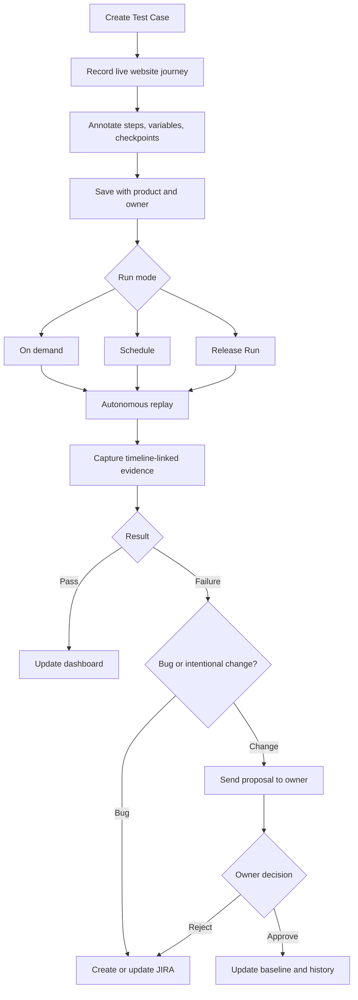

# Sentinel Software Requirements Document

**Version:** v1.0 planning baseline  
**Date:** 2026-08-05  
**Source:** `sentinel-detailed-requirements.md`

## 1. Product summary

Sentinel lets a person teach a browser-based test journey once, save it as a product-owned Test Case, replay it autonomously, and inspect a complete evidence bundle for every Run. Human approval remains required for checkpoints, proposed expectation changes, and other consequential decisions.

## 2. Scope

### In scope

- Multiple internal web products in the QA environment.
- Ten concurrent named users initially.
- Organization-level shared login and individual logins, with named ownership retained.
- Guided recording, replay, evidence capture, data variables, negative-test suggestions, test/release management, dashboards, notifications, JIRA, change approval, and read-only PostgreSQL insight.

### Out of scope for v1

- iOS and Android testing.
- Any database write or delete access.
- Migration of existing automated tests.
- Source-control integration for root-cause correlation.

## 3. Users, roles, and ownership

| User or role | Required capability |
|---|---|
| Tester or feature expert | Create, teach, edit, run, inspect, and manage tests for products they can access. |
| Test owner | The person who created a Test Case; owns it and approves expected-behavior changes. |
| QA lead | Organize products and releases, trigger release runs, and review consolidated readiness. This is a capability, not a replacement for per-test approval. |
| Developer | Inspect evidence, understand failures, and use JIRA output; may teach a test when they understand the feature. |
| Product manager | May teach or inspect a test when appropriate. |

Every Test Case stores its product, owner, creation timestamp, and change history. Shared authentication must not erase the individual actor identity.

## 4. Domain terms

- **Test Case:** A named, reusable journey taught by a person.
- **Step:** One recorded action or checkpoint in a Test Case.
- **Run:** One execution of a Test Case, whether manual-triggered, scheduled, or part of a Release Run.
- **Evidence Bundle:** Privacy-safe screenshots, network, console, storage, and later database context associated with a Run. Full browser video is intentionally excluded.
- **Variable:** A value that is static, pooled, or supplied per Run.
- **Checkpoint:** A step where automation pauses for human confirmation.
- **Release Run:** A batch execution of all Test Cases tagged to a release.

## 5. Product journey

## 6. Functional requirements

### F1. Guided test creation and recording

1. The dashboard provides **Add New Test**.
2. The creation form requires Test Name and Website Link and associates the selected product and current named owner.
3. The Recording Workspace shows an interactive live website beside a real-time plain-English Step Log.
4. Clicks, text entry, navigation, and page loads create step entries automatically.
5. Each step can be edited and can contain a description, expected outcome, conditional instruction, checkpoint flag, and important-screenshot flag.
6. Typed values can be marked inline as variables.
7. The tester can save at any point or discard the recording without creating a Test Case.
8. A named user can create a Product with a required unique name, rename a Product they created using the same validation, and open the Test Case inventory pre-filtered to that Product. Product names are trimmed; blank and duplicate names are rejected with clear feedback.
9. During Phase 1 recording, the embedded browser is locked to the approved demo target. Browser chrome and host WebDriver access are unavailable to the tester, and off-target navigation is blocked by managed browser policy.

### F2. Complete evidence capture

Every Run must persist its outcome, timestamps, step results, linked evidence, and a separate indication when evidence capture was partial. A teaching session persists its recorded steps, not a browser-video recording.

For every Run, capture and retain the applicable evidence bundle:

- Network requests and responses with endpoint, status, timing, payload, and slow/error highlighting.
- Timestamped console output, including errors and warnings.
- localStorage, sessionStorage, and cookie state at step boundaries.
- Screenshots at start, end, failure, and—when later implemented—explicitly flagged steps.

Full browser-video recordings must not be captured or retained. Phase 2 provides an explicitly tester-guided Demo CRM Run: the tester approves saved steps in strict order, and Sentinel applies each approved step visibly in the isolated browser before marking it passed. The tester can fail the active step instead. This is reviewed, step-by-step replay rather than an autonomous Run: it has no queue, retry, checkpoint, or unattended execution. All evidence is accessible from one Run Detail view and is timeline-linked to the Step Log for passed, failed, and interrupted Runs.

### F3. Autonomous replay

- Preserve Phase 2 Guided Run and offer a separate product-authorized Auto Run action.
- Run a saved Test Case without a human present unless a checkpoint is reached, using an isolated headless browser context.
- For the Docker-local Demo CRM, use server-only worker credentials; never persist credentials in a Run or evidence bundle.
- Replay the initial navigation, then execute recorded text and click actions. Later navigation records are URL milestones and must not reload in-page state.
- Tolerate limited cosmetic change only through ordered exact, unique selector fallbacks. A missing or multiple match must stop safely and report the reason; no fuzzy or AI selector guess may continue a Run.
- Treat free-text expected outcomes as evidence context, not executable assertions.
- A checkpoint is marked while recording. After its action executes, Auto Run captures checkpoint evidence and pauses up to 10 minutes for screenshot/outcome review and explicit Continue or Cancel.
- Support explicit cancellation with final available evidence and an `Interrupted` outcome.
- Retry once only for allowlisted transient browser startup/navigation failures. Preserve the original failed attempt; never retry ambiguity, action failure, checkpoint timeout, or cancellation.
- Process at most two autonomous Docker-local Runs concurrently while keeping the Phase 2 noVNC guided browser separate.
- Compare successful Auto Run active duration, excluding queue/checkpoint/retry wait, against the median of the latest three successful guided Runs of the same Test Case version when available.
- Produce the complete F2 Evidence Bundle for every Auto Run without retaining browser video.
- Resolve non-password variables through encrypted Phase 4 Run bindings. Password steps remain server-configured credentials and are never variable values.

### F4. Test data and variables

Support static reusable defaults, a product-scoped local reusable-data pool, and values supplied manually before either a Guided or Auto Run. A variable name is a case-insensitive identifier shared by every matching step in a Test Case version. Its recorded non-secret value becomes an encrypted static default when the Test Case is saved; the saved and recorded step show a placeholder rather than the raw value.

Before starting a Run, the tester chooses a static default, one eligible pool data set, or a manual value for each required variable. Sentinel persists an encrypted Run binding once so a refresh or Auto Run retry uses the same value. Bindings, raw pool fields, and raw static values never appear in steps, API responses after entry, Run Detail, audit text, logs, or evidence. Passwords, tokens, secrets, cookies, authorization values, and API-key variants are rejected as Phase 4 variable values; the existing server-only Demo CRM password path remains separate.

Product members may manage named local data sets without viewing values after creation. Each data set holds encrypted fields keyed by variable name and has a lifecycle of `safe`, `reserved`, `consumed`, or `invalid`. Starting a Run reserves the selected safe data set atomically after authorization and field-completeness checks. A passed Run consumes it; failed, interrupted, cancelled, and preflight-rejected Runs release it. Consumed and invalid sets are never reset; a product member creates a replacement. Members may invalidate an eligible safe set. Phase 4 validates only the local pool lifecycle and required fields. External adapters and QA PostgreSQL read-only checks remain deferred to F10.

Variables remain markable during recording through an explicit user-entered canonical name. Automated variable-name suggestions are deferred until Sentinel has a recorder design that can identify a settled field value without creating per-keystroke steps. Fresh data still comes through an application workflow or an existing pool, never a database write.

### F5. Edge-case and negative testing

After saving a happy-path Test Case, Sentinel may suggest high-confidence variations such as missing required fields, invalid input, and boundary values. Suggestions are drafts only. The tester can approve, edit, or dismiss each one. Approved suggestions become independently owned Test Cases.

Default planning assumption: conservative suggestions to limit tester fatigue.

### F6. Test and release management

- Organize Test Cases by product and feature area.
- Run any Test Case individually at any time.
- Update an existing Test Case by changing affected steps or outcomes rather than re-recording everything.
- Create releases and tag Test Cases across products.
- Trigger a Release Run for all tagged Test Cases.
- Produce a consolidated pass/fail release-readiness report.
- Keep release use optional; ad hoc execution must work independently.

### F7. Reporting, dashboard, and notifications

The dashboard shows, per product, Test Cases, last Run, current status, and recent failure frequency. It also exposes Run Detail, flakiness trends, and coverage growth. At minimum, email notifications are required for failures, pending expectation proposals, and checkpoint pauses. Slack is an optional integration if available.

### F8. JIRA integration

For a likely genuine bug, automatically create a JIRA issue containing the tested journey, failure, reproduction steps, product/release context, and linked or attached evidence. Search for an existing open issue covering the same failure before creating a duplicate; add a comment and new evidence when one exists. Allow the owner to review or edit issue details before or immediately after filing.

### F9. Change-aware maintenance and approval

Classify failures as likely bugs or likely intentional changes. For likely changes, draft updated steps or expectations and send the proposal to the original Test Case owner. The old baseline remains active until explicit approval. The owner can compare, approve, or reject. Approval updates the baseline; rejection routes the failure to JIRA. Keep a complete proposal and decision history. Re-running after a known QA deployment is the primary trigger; source-control correlation remains optional future work.

### F10. Read-only database insight

When a Run fails, Sentinel may query relevant QA PostgreSQL data to explain record existence or state. Include the result in the Evidence Bundle and relevant JIRA issue. Database credentials must be read-only and technically incapable of insert, update, delete, schema change, or transaction write.

## 7. Cross-cutting requirements

### Security and privacy

- Enforce product and Test Case authorization.
- Protect credentials, cookies, tokens, evidence artifacts, payloads, and database results.
- Redact configured secrets and sensitive fields from evidence and notifications.
- Use least-privilege credentials for browser, JIRA, storage, and database integrations.
- Audit ownership, approvals, Run actions, and external side effects.

### Reliability and safety

- A low-confidence replay must stop, not guess.
- Checkpoints must block consequential continuation until a human confirms.
- Evidence capture must be attempted even on failure and must report partial-capture errors.
- Background jobs must expose state, retry safely, and avoid duplicate JIRA issues.

### Performance and scale

- Initial target is 10 concurrent users.
- Batch Runs must support controlled parallelism.
- Replay should not exceed equivalent manual duration for the same journey.
- Evidence retention and concurrency limits require an operational decision before production.

## 8. Acceptance criteria for the product baseline

- A named user can create a product-specific Test Case and see their ownership recorded.
- Recording captures navigation, click, and text-entry steps in order.
- A tester can edit step text, add an expected outcome, mark a variable, save, or discard.
- A saved Test Case can be opened and run independently of the recording screen.
- A Run has a pass/fail status, timestamps, step results, linked evidence, and a Run Detail location; it has no stored full browser-video recording.
- A variable-marked Test Case can run in Guided or Auto mode with encrypted static, pooled, or manual bindings, and neither raw values nor secret-like values are exposed through Sentinel artifacts.
- A failure stops safely, records available evidence, and exposes a clear reason.
- A Release Run reports every included Test Case and its result.
- A proposed expectation change cannot alter the baseline without owner approval.
- JIRA integration never creates duplicate open issues for the same tracked failure.
- Database insight cannot write to PostgreSQL.

## 9. Ambiguities and conflicts to resolve

1. Shared login is required while ownership must remain individual; the identity-mapping mechanism is unspecified.
2. “Fully interactive” embedded websites may conflict with browser security headers, cross-origin isolation, third-party login, and payment flows.
3. Full network payload capture may expose credentials or personal data; redaction and retention policy are unspecified.
4. “No slower than manual” needs a measurement definition and benchmark set.
5. Pooled-data invalidation may be inferred from the application, database, or both; precedence is unspecified.
6. The policy for ownership reassignment is unspecified.
7. The exact JIRA project, issue type, fields, duplicate-matching rule, and evidence size limits are unspecified.
8. Email provider, Slack availability, schedules, release deployment signals, and database query configuration are unspecified.
9. “Conservative” edge-case suggestions needs an operational confidence threshold.
10. Evidence retention, storage budget, concurrency limits, and target success metrics are unspecified.

## 10. Explicit non-scope and assumptions

Mobile is intentionally deferred. Database access is read-only. Source-control access is not a v1 dependency. The requirements’ conservative edge-case suggestion assumption is adopted until product data supports revision. Ownership reassignment and success metrics must be resolved before launch.
